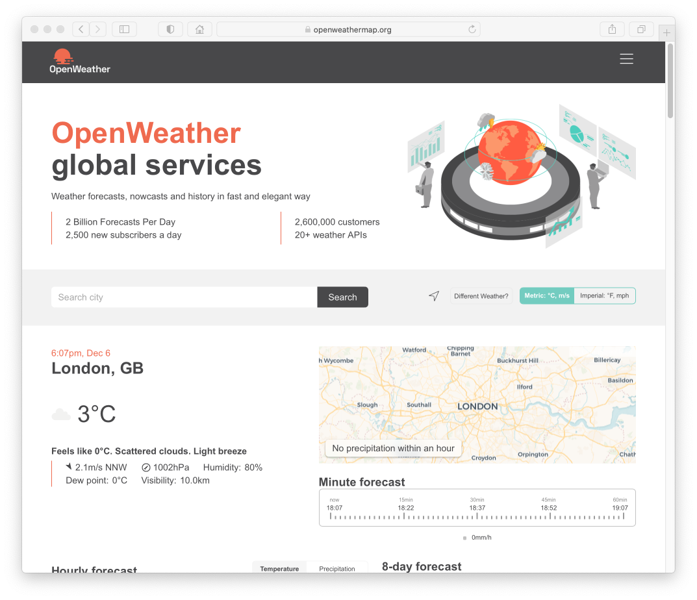
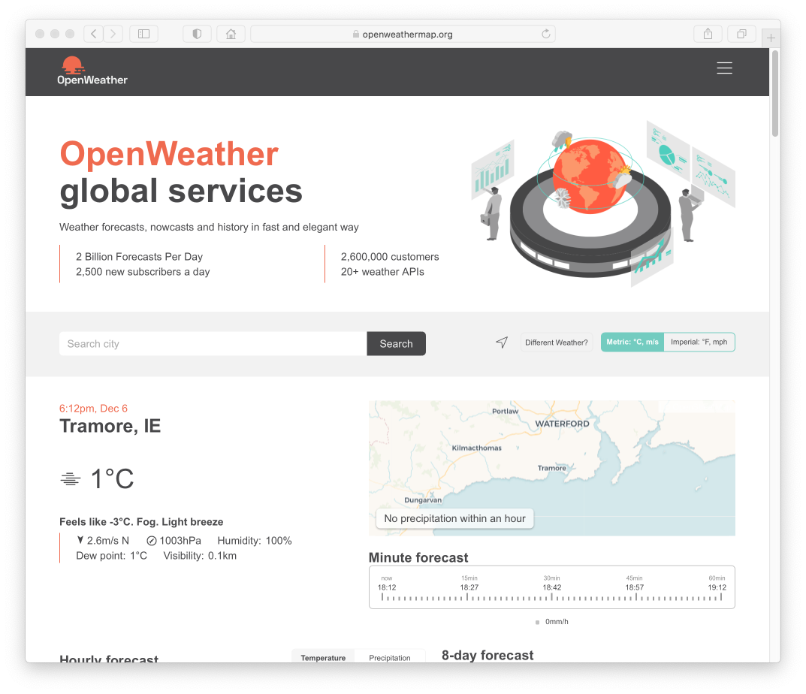
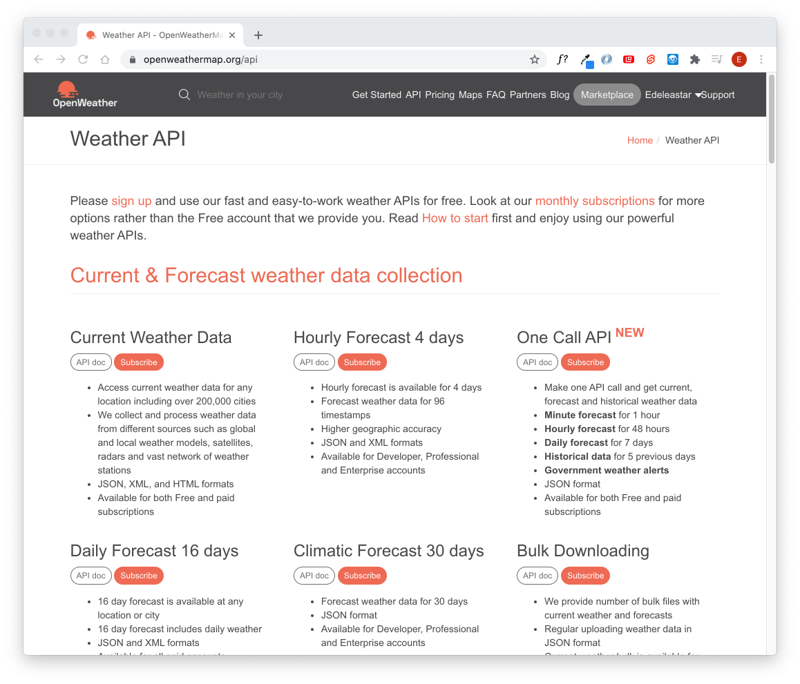

# Open Weather

Visit:

- <https://openweathermap.org>

Search for your location:

You should see weather data for your area.

Sign up for an account and log in - and select `API` from the menu:

Select `Currente Weather Data` - and press `Subscribe`

Press `Get API Key` - and generate a Key:

Perhaps giving it a name.

Before testing the key - have a quick look here:

- <https://openweathermap.org/faq>

In particular - look at the question:

- Do I need to activate my API key?

You key will be activated automatically in between 10 minutes & 2 hours! However, < 10 minutes seems typical
