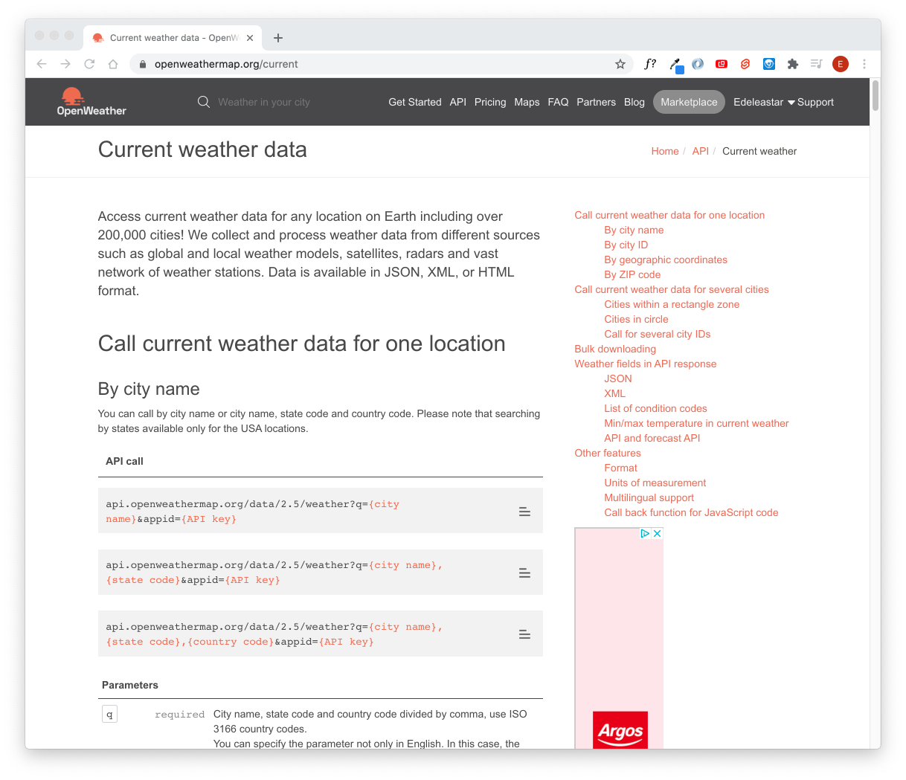
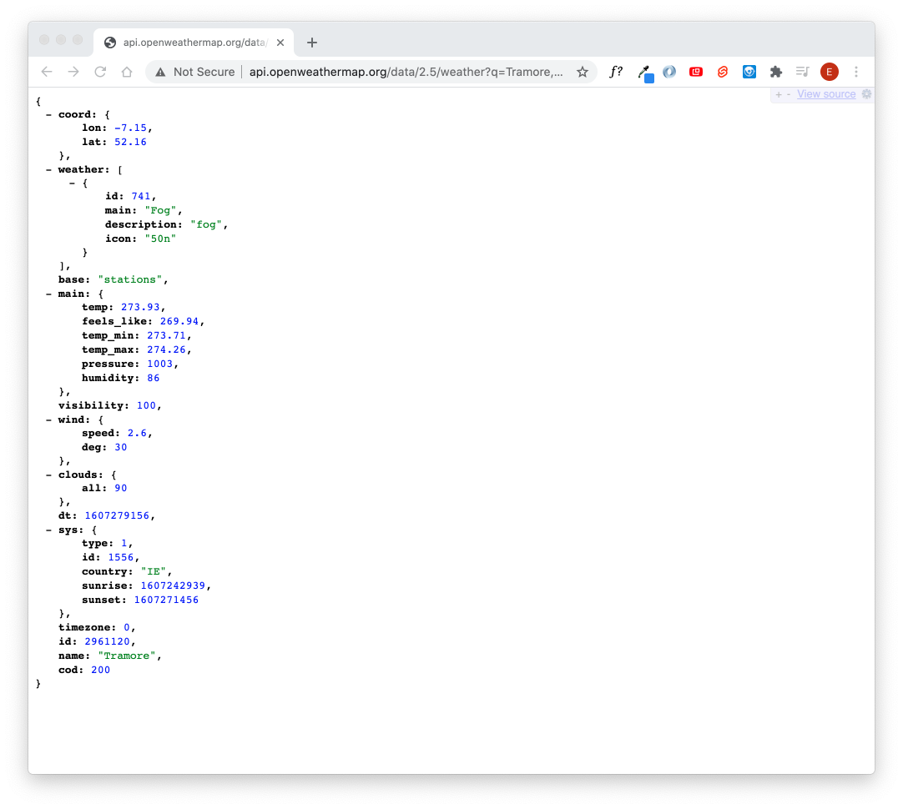

# Current Weather

Here is the documentation for the current weather API:

- https://openweathermap.org/current>

In an text editor, compose your request (inserting your key at the end)

~~~
http://api.openweathermap.org/data/2.5/weather?q=Tramore,Ireland&appid=YOUR_API_KEY
~~~

Copy this into the address bar of a browser and we should be able to retrieve current weather data:

In your browser, the entire JSON content may be displayed on a single line. If this is the case, try installing a plugin to display Json nicely formatted:

- <https://chrome.google.com/webstore/detail/jsonview>

There are a range of plugins that can do this task.

Experiment with some other locations (`Tramore, Ireland`) above

~~~
http://api.openweathermap.org/data/2.5/weather?q=Tromsø,NO&appid=YOUR_API_KEY
~~~

~~~json
{
  coord: {
    lon: 18.96,
    lat: 69.65
  },
  weather: [
    {
      id: 801,
      main: "Clouds",
      description: "few clouds",
      icon: "02n"
    }
  ],
  base: "stations",
  main: {
    temp: 269.05,
    feels_like: 263.55,
    temp_min: 268.15,
    temp_max: 269.82,
    pressure: 1017,
    humidity: 92
  },
  visibility: 10000,
  wind: {
    speed: 4.1,
    deg: 100
  },
  clouds: {
    all: 20
  },
  dt: 1607279413,
  sys: {
    type: 1,
    id: 1681,
    country: "NO",
    sunrise: 0,
    sunset: 0
  },
  timezone: 3600,
  id: 6453316,
  name: "Tromsø",
  cod: 200
}
~~~