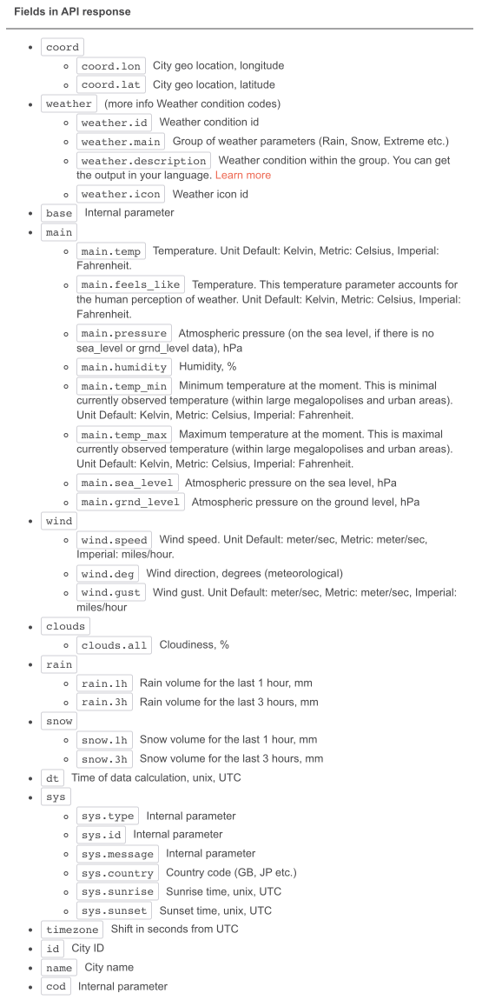

## Docs

Have a look at the developer documentation:

- https://openweathermap.org/current#parameter>

Here is a breakdown of the fields form the above:

Inspect the sample values you have retrieved and relate them to the above.