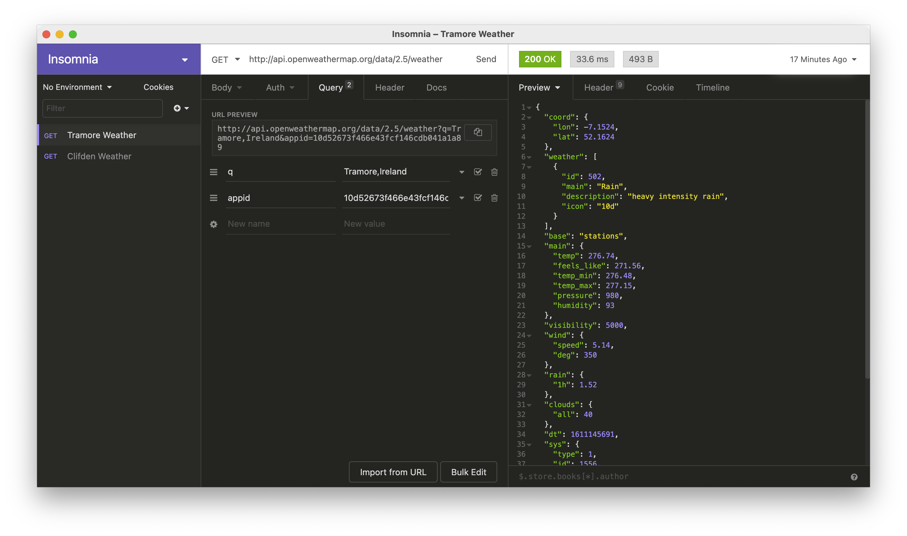
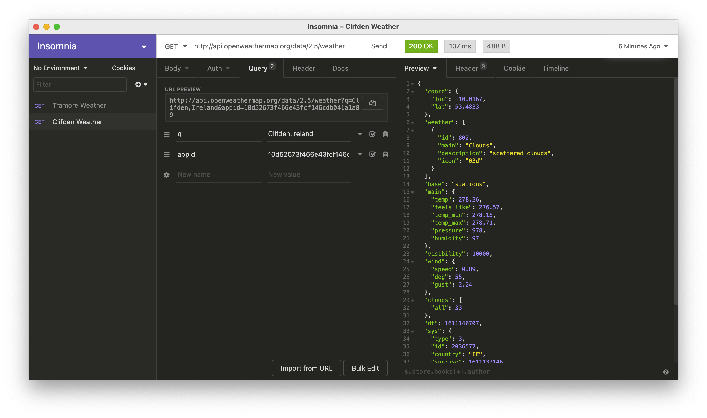
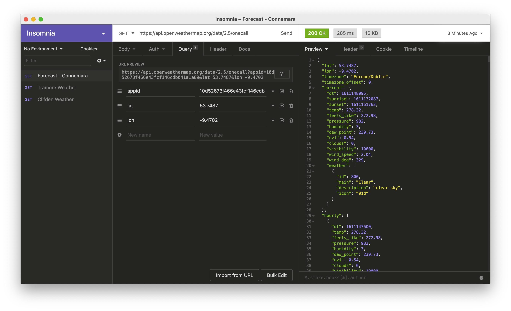

# Exercises

# Exercise 1: Insomnia Current Weather

Install the Insomnia Core Rest client:

- <https://insomnia.rest/download>

Create an new request and verify that you can retrieve the current weather for your location.

Experiment with creating multiple named requests:

- Tramore
- Clifden

Set up each of these requests with the same URL:

- http://api.openweathermap.org/data/2.5/weather

and provide the location + api as `Query` parameters:

The requests can be named whatever you like

# Exercise 2: Weather Forecast

Experiment with this api:

- <https://openweathermap.org/api/one-call-api>

This is a forecast for a specific location specified as lat/long value.
