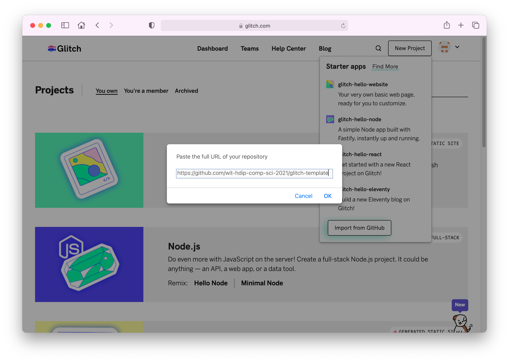
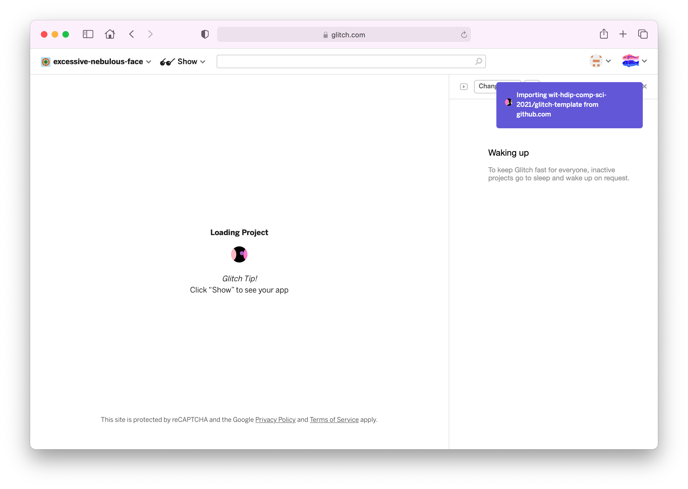
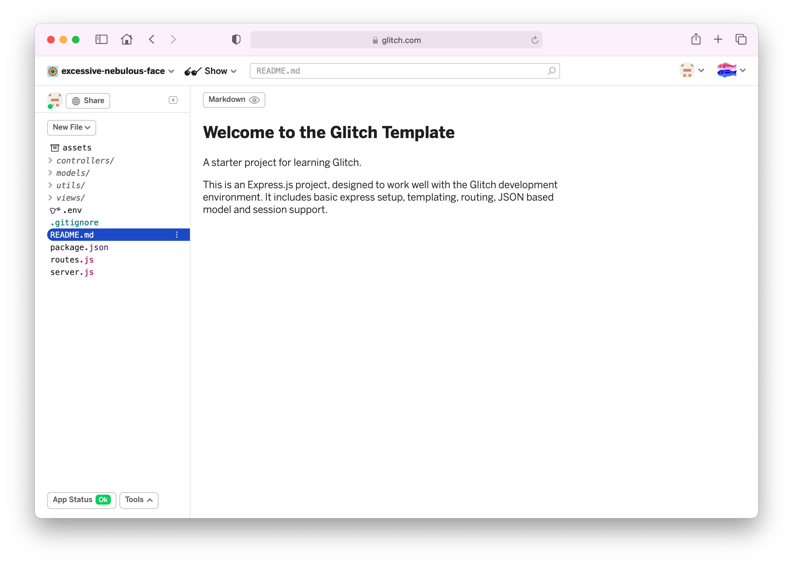

# Create Project

From the menus select `New Project`:


Press `Import from Github`:



In the dialog, enter this repo:

```bash
https://github.com/wit-hdip-comp-sci-2021/glitch-template
```

It will take a few seconds to load:



Eventually the project will be imported:



This mirrors the procedure we used to create a Play project in Web Development - we cloned an existing project as a starting point.
