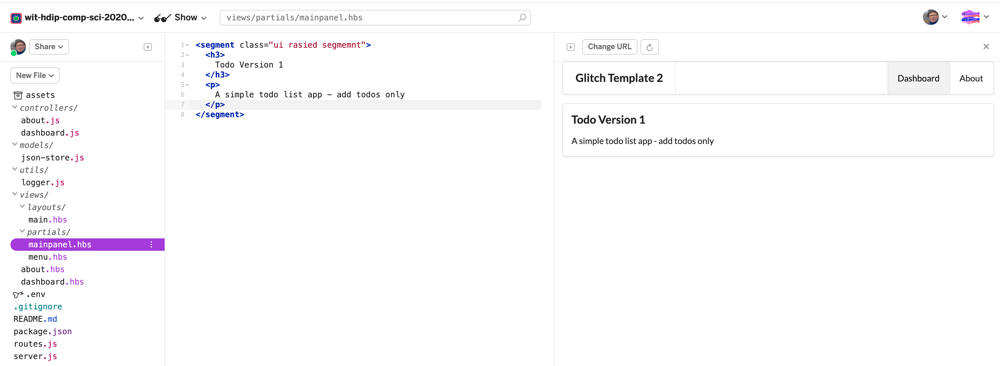

# Branding

First some small changes to the UX

## views/about.hbs

```html
{{> menu id="about"}}

<section class="ui center aligned middle aligned segment">
  <h3>
    Weather App Experiment
  </h3>
  <p>
    A simple list of Weather Reports
  </p>
</section>
```

As you make these changes, they should appear in the live application:



We might also change the some titles in the menu:

## views/partials/menu.hbs

```html
<nav class="ui menu">
  <header class="ui header item">Weather App Experiments</header>
  <div class="right menu">
    <a id="dashboard" class="item" href="/dashboard"> Dashboard </a>
    <a id="about" class="item" href="/about"> About </a>
  </div>
</nav>

<script>
  $("#{{id}}").addClass("active item");
</script>
```
