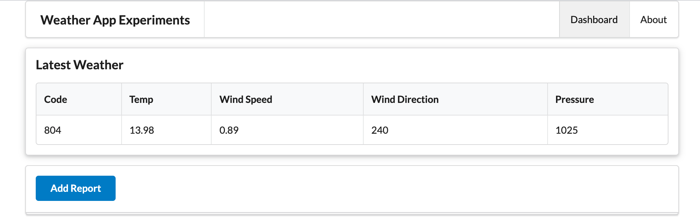

# Weather Report

We would like to present a UX like this:

This presents a latest weather report from some location - updated when the button is pressed.

We need these partials:

### views/partials/reading-header.hbs

~~~html
<tr>
  <th> Code </th>
  <th> Temp </th>
  <th> Wind Speed </th>
  <th> Wind Direction </th>
  <th> Pressure </th>
</tr>
~~~

#### views/partials/reading-row.hbs

~~~html
<tr>
  <td> {{reading.code}}   </td>
  <td> {{reading.temperature}} </td>
  <td> {{reading.windSpeed}} </td>
  <td> {{reading.windDirection}} </td>
  <td> {{reading.pressure}} </td>
</tr>
~~~

#### view/partials/readling-table.hbs

~~~html
<table class="ui celled table">
  <thead>
    {{> reading-header }}
  </thead>
  <tbody>
    {{> reading-row }}
  </tbody>
</table>
~~~

Add this new route:

### routes.js

~~~
router.post("/dashboard/addreport", dashboard.addreport);
~~~

Now we can implement the action:

### controllers/dashboard.js

~~~javascript
  async addreport(request, response) {
    logger.info("rendering new report");
    const report = {};
    const viewData = {
      title: "Weather Report",
      reading : report
    };
    response.render("dashboard", viewData);
  },
~~~

The app should run now without any errors - although there will be no data displayed yet.
