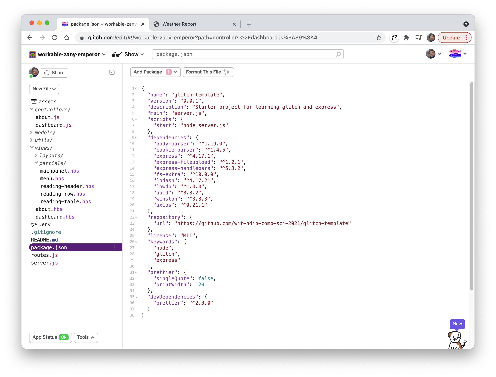
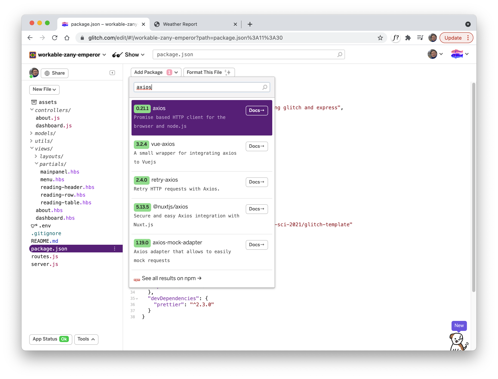

###  Axios Component

To make api requests to external services, we need a new library component:

- https://axios-http.com/

The procedure for installing this component will be different depending on whether you are using Glitch or developing offline using WebStorm.

### Glitch

Open the package.json file:

Select `Add Package` button and enter `axios`:

Select the axios - and it will install the package. Make sure the axios appears in the package.json file:

~~~json
{
  "name": "glitch-template",
  "version": "0.0.1",
  "description": "Starter project for learning glitch and express",
  "main": "server.js",
  "scripts": {
    "start": "node server.js"
  },
  "dependencies": {
    "body-parser": "^1.19.0",
    "cookie-parser": "^1.4.5",
    "express": "^4.17.1",
    "express-fileupload": "^1.2.1",
    "express-handlebars": "^5.3.2",
    "fs-extra": "^10.0.0",
    "lodash": "^4.17.21",
    "lowdb": "^1.0.0",
    "uuid": "^8.3.2",
    "winston": "^3.3.3",
    "axios": "^0.21.1"
  },
  "repository": {
    "url": "https://github.com/wit-hdip-comp-sci-2021/glitch-template"
  },
  "license": "MIT",
  "keywords": [
    "node",
    "glitch",
    "express"
  ],
  "prettier": {
    "singleQuote": false,
    "printWidth": 120
  },
  "devDependencies": {
    "prettier": "^2.3.0"
  }
}
~~~

### Webstorm

For webstorm, the procedure is slightly simpler. Open a shell on the project folder, and enter this command:

~~~bash
npm install axios
~~~

Check to see if the package.json file is updated as above.
