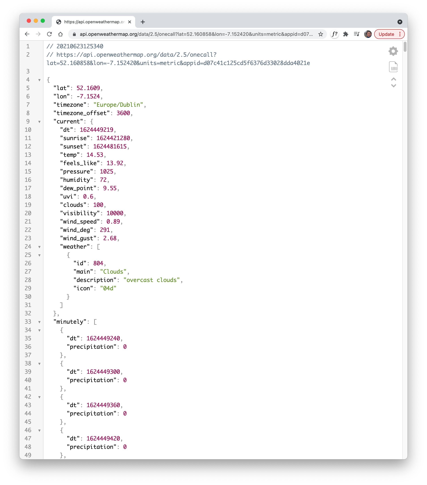
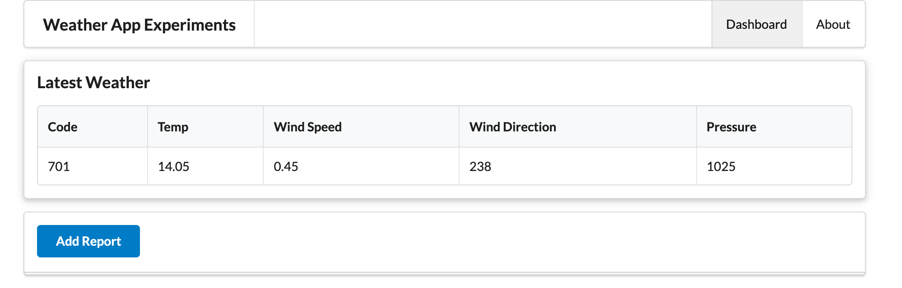
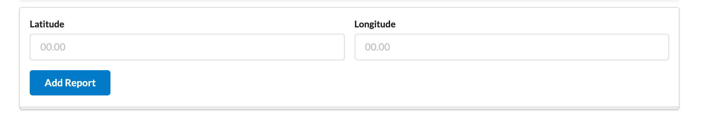

# API Request

From the last lab you should already be able to make a request to OpenWeatherApi via the browser.

~~~bash
https://api.openweathermap.org/data/2.5/onecall?lat=52.160858&lon=-7.152420&units=metric&appid=YOUR_API_KEY_HERE
~~~

Try this now - appending your OpenWeatherAPI api key as indicated above:

 We will now integrate a call to this API from our controller.

### controllers/dashboard.js

First, import axios at the top:

~~~javascript
const axios = require("axios");
~~~

We can define a string that hard codes the location lat/lng + our API key:

~~~
const oneCallRequest = `https://api.openweathermap.org/data/2.5/onecall?lat=52.160858&lon=-7.152420&units=metric&appid=YOUR_KEY_HERE`
~~~

Then, in the addreport action, rework to access the API:

~~~javascript
  async addreport(request, response) {
    logger.info("rendering new report");
    let report = {};
    const result = await axios.get(oneCallRequest);
    if (result.status == 200) {
      const reading = result.data.current;
      report.code = reading.weather[0].id;
      report.temperature = reading.temp;
      report.windSpeed = reading.wind_speed;
      report.pressure = reading.pressure;
      report.windDirection = reading.wind_deg;
    }
    console.log(report);
    const viewData = {
      title: "Weather Report",
      reading: report
    };
    response.render("dashboard", viewData);
  }
~~~

Pressing the button should now reveal the latest weather report:

Currently the location is hard coded. We can extend the UX to accept the lat/lng:

~~~handlebars
<form class="ui stacked segment form" action="/dashboard/addreport" method="POST">
  

    

      <label>Latitude</label> <input placeholder="00.00" type="text" name="lat">
    

    

      <label>Longitude</label> <input placeholder="00.00" type="text" name="lng">
    

  

  <button class="ui blue submit button">Add Report</button>
</form>
~~~

This is a revised version of the action, to get a report from the location as entered in the form:

~~~javascript
  async addreport(request, response) {
    logger.info("rendering new report");
    let report = {};
    const lat = request.body.lat;
    const lng = request.body.lng;
    const requestUrl = `https://api.openweathermap.org/data/2.5/onecall?lat=${lat}&lon=${lng}&units=metric&appid=YOUR_API_KEY_HERE`
    const result = await axios.get(requestUrl);
    if (result.status == 200) {
      const reading = result.data.current;
      report.code = reading.weather[0].id;
      report.temperature = reading.temp;
      report.windSpeed = reading.wind_speed;
      report.pressure = reading.pressure;
      report.windDirection = reading.wind_deg;
    }
    console.log(report);
    const viewData = {
      title: "Weather Report",
      reading: report
    };
    response.render("dashboard", viewData);
  }
~~~

