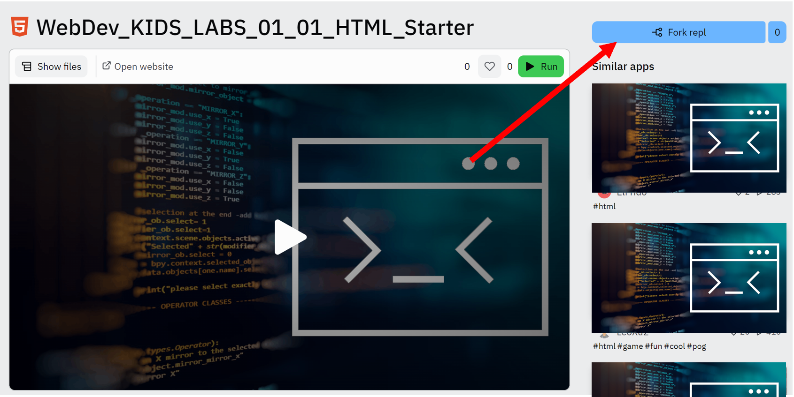
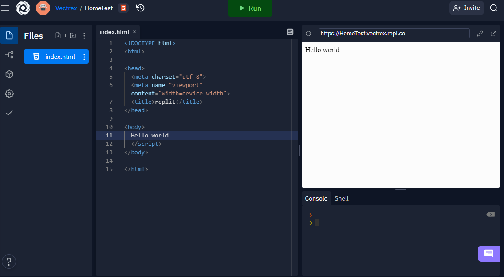

# Registrierung bei Replit

## Registrieren 

1. Unter dem link: https://replit.com/signup?from=landing einen Account anlegen

2. E-Mail verifizieren

## Projekt starten

Um möglichst schnell mit der Entwicklung zu starten, stellen wir Ihnen StarterCode für jede Aufgabe zur Verfügung.
Bitte klicken Sie auf folgenden Link und "forken" sich das folgende Projekt:
[test](LINK MISSING)

## Entwicklungsoberfläche

Die Entwicklungsoberfläche in Replit besteht aus 4 Elementen:

- FileExplorer (linke Seite) zur Auswahl der zu editierbaren Files
- Editor (Mitte)
- Anzeige (rechts oben) - hier werden HTML Dateien angezeigt
- Console und Shell (unten rechts) - für Debugging, direkter Eingabe von Kommandos
- **Run** Button für die Ausführung der Index.html

## Warum Replit?

Um den Einstieg in das Thema Web-Development noch einfacher zu gestalten, lässt sich statt eine installierte Entwicklungsumgebung auch
ein Online Editor verwenden.

Empfohlen wird der Online-Editor Replit, in dem in kürzester Zeit mit dem Entwickeln begonnen werden kann.
Bitte registrieren Sie sich und machen Sie sich kurz mit der Oberfläche vertraut (Siehe Screenshot) und beginnen Sie dann mit den Übungen.
