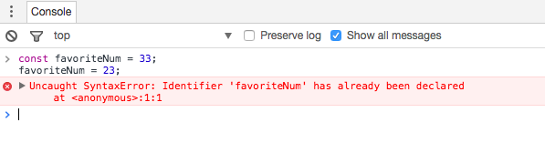
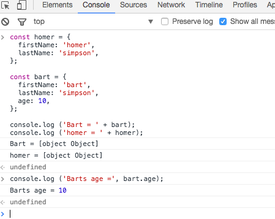

# Const, Let & Simple Objects

## Const & Let

The variable statement declares a variable, optionally initializing it to a value.

### var

~~~javascript
// String
var greeting = “hello";
// Number
var favoriteNum = 33;
~~~

### const

The `const` statement is similar to the var statement, however, the value cannot be redeclared or reassigned.

~~~javascript
// String
const greeting = 'hello';

// Number
const favoriteNum = 33;
~~~

So if we try this:

~~~javascript
favoriteNum = 23;
~~~

We will get an error. Try the above in the chrome console now and see what happens. You should see something like this:

### let 
We can also use `let`:

~~~javascript
let anotherFavourite = 33;
anotherFavourite = 32;
~~~

This is similar to `var`, in that it introduces a variable that can be reassigned later. It has other benefits we will explore in subsequent lessons.

In our applications, we will always use `const` or `let`, and avoid using `var`.

## Simple Objects

Whereas primitive data typed variables hold individual values. e.g:

- numbers
- strings
- boolean

Object types can hold more than one value. e.g.:

- a number AND a string.
- 2 numbers and a boolean and a string
- 3 strings and 2 numbers

Objects are central to creating interesting and powerful programs.

Try this on the console (remember to use Shift and Enter to go onto a new line for entering multiple lines of code:

~~~
const homer = {
  firstName: 'homer',
  lastName: 'simpson',
};
~~~

Then try this:

~~~
console.log(homer);
~~~

This will look like this:

Try this object:

~~~javascript
const bart = {
  firstName: 'bart',
  lastName: 'simpson',
  age: 10,
};

console.log(bart);
~~~

We have now created 2 objects. We can print the two of them again:

~~~javascript
console.log ('Bart = ' + bart);
console.log ('homer = ' + homer);
~~~

We can also print out individual attributes:

~~~javascript
console.log ('Barts age =', bart.age);
~~~

# Exercises

For these exercises, create:

## simpsons.html

~~~html
<!DOCTYPE html>
<html>
  <head>
    <title>JavaScript Test Site</title>
    
  </head>
  <body>
    
Nothing going on yet.

  </body>
</html>
~~~

## simpsons.js

~~~javascript
// JS Code here
~~~

And use the developer tools in chrome to run and monitor the script.

## Exercise 1: Maggie

In `simpsons.js`, Create an object called `maggie`, with Maggies details (say her age is 2). Log the object to the console. Load `simpsons.html` and make sure maggies details appear on the console.

## Exercise 2: Lisa

Create an object called `lisa`, with Lisa's details (say her age is 12). In addition, store her favourite musical instrument. Log the object to the console.

