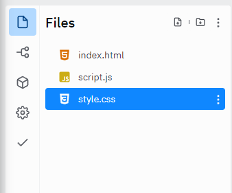

# Einleitung

Dank CSS kann ich Inhalt im Web nicht nur darstellen, sondern auch stylen. 

Ziel dieser Übung soll es sein, die gerade erstellte HTML Datei mit individuellem CSS zu verschönern.

### Ausgliederung von CSS
CSS lässt sich sehr einfach in eine eigene Datei ausgliedern. Dies sorgt für einen besseren Überblick.

~~~html
    <link href="style.css" rel="stylesheet" type="text/css" />
~~~

Diese Zeile im Code verweist auf die style.css Datei, die Sie links im Datei-Explorer finden:

### Tipps

Sie finden eine sehr gute Dokumentation über CSS auch unter:
https://developer.mozilla.org/de/docs/Learn/Getting_started_with_the_web/CSS_basics

oder eine einfache Übersicht von CSS Features (inkl. Code Beispielen) unter:
https://www.w3schools.com/css/default.asp