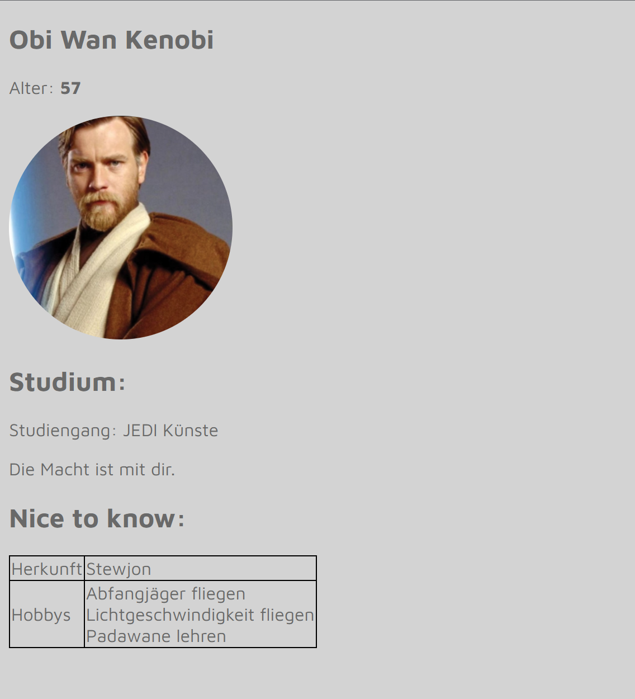

# HTML mit CSS stylen

### Anforderungen an Ihre Seite

Bitte gestalten Sie Ihre Seite nach folgenden Anforderungen:
- Geben Sie Ihrer Website einen Hintergrund in Farbe `lightgrey`
- Alle Inhalte der Seite sind centered
- Die Schriftart auf Ihrer Seite soll `Maven Pro` sein
- Alle Texte haben die Schriftfarbe `dimgrey`
- H2 Überschriften haben eine Größe von 30px
- Das Bild sollte eine Höhe von 200px haben
- Das Bild soll rund sein
- Ihr Studiengang sollte in einer schwarzen Schrift kursiv geschrieben werden
- Jede Zelle der Tabelle sollte einen Rahmen haben
- die linke Spalte der Tabelle soll 100px breit sein und 50px hoch
- die rechte Sptalte der Tabelle soll 200px breit sein und 50px hoch

### Hilfestellungen

### Anlegen von Klassen und ID`s

Step by Step Anleitung aufklappen

1. Vergeben Sie Klassen und IDs für Elemente, um diese individuell ansprechen zu können.
~~~html
    <h2 class="Classname"></h2>
    <h2 id="IDName"></h2>
~~~
2. Ergänzen Sie Objekte wie divs, paragraphs oder spans um bestimmte Textsektionen ansprechen zu können.
~~~html
    Ich bin ein Text
~~~

  

### CSS schreiben

Step by Step Anleitung aufklappen

Diese Anleitung ist nur eine Möglichkeit, wie man vorgehen kann.

1. Öffnen Sie die style.css Datei im Explorer links

2. Beginnen Sie mit möglichst großen Ebenen. Zum Beispiel: "Die Schriftart auf Ihrer Seite soll "Maven Pro" sein" - Eine Anforderung für alle Elemente auf Ihrer Seite

3. Stylen Sie die Überschriften

4. Setzen sie die Größe und Form des Profilbildes

***Tipp***: Die Form des Bildes kann mit dem `border-radius` beeinflusst werden.

6. Legen Sie die Schrift des Studienganges fest

7. Geben Sie jeder Zelle der Tabelle einen Rahmen

8. Legen Sie die Breiten der Tabellenfelder fest
 
***Tipp***: Schon Klassen vergeben?

  

