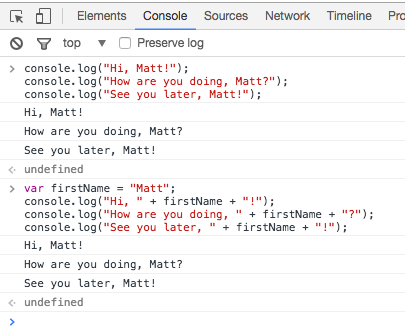

# Variables

## Fundamentals

What's a variable, and why would you ever want to use one? The word "variable" may be most familiar to you mathematics classes, when you often use letters like _x_ or _y_ to represent numbers.

This idea also exists in programming languages. Using variables lets us write code that's easier to read and also easier to change. It's unlikely you'll ever write a significant amount of JavaScript code without using variables, so it's good to get used to them early.

To see why variables are useful, suppose you want to log a set of greetings to the console:

~~~javascript
console.log("Hi, Matt!");
console.log("How are you doing, Matt?");
console.log("See you later, Matt!");
~~~

Paste the above into the console in Chrome.

This works fine, but what if we want to change the person's name from "Matt" to something else? We'll have to change three different spots in our text file, and there's a risk that we'll make a typo when fixing any one of these changes. Wouldn't it be better if we could just store a single copy of the name, and use it wherever we want?

Variables give us this ability. So let's write our first variable. In JavaScript, you can initialize variables using the `var` keyword. Try this:

~~~javascript
var firstName = "Matt";
console.log("Hi, " + firstName + "!");
console.log("How are you doing, " + firstName + "?");
console.log("See you later, " + firstName + "!");
~~~

If you enter this code correctly, you should see the same result as before - JavaScript knows that `firstName` corresponds to the name Matt! 

There are a few different things going on here, so let's unpack the code a bit. On the first line, we're declaring a variable using the `var` keyword. A variable is just a way for us to save some data in JavaScript. When we typed in `var firstName = "Matt"`, JavaScript stored the word `Matt` in the variable `firstName`. From then on, any time you use `firstName` in the console while this window is still open, you'll see the value that `firstName` has stored.

On the subsequent lines, you'll see there's something else going on too: we're using the `+` operator to combine words made up of characters, or _strings_, together. In JavaScript, when you combine two strings with the `+` operator, you get a new string which is a combination of the two. You can think of this as adding the strings together; a more formal name for it is _concatenation_. For example, if you write the expression `"Hello" + " World"` in the console, you should see that the result is the single string `"Hello World"`.

Let's declare some more variables.

~~~javascript
var firstName = "Matt";
var lastName = "Lane";
var fullName = firstName + " " + lastName;
~~~

In all of these examples, we have the keyword `var` in front, followed by the variable name, an assignment operator (the `=` sign), and then the value we want to assign to our variable.

These examples also illustrate a common convention when writing JavaScript: when declaring variables using multiple words, the standard is to capitalize each word after the first word, and otherwise use lower-case letters (e.g. `firstName`, not `firstname`, `first_name`, `FirstName`, or some other variation). This casing convention is called camel case, and while your JavaScript code will work just fine if you don't abide by this convention, it's good to get in the habit of camel casing your variables.

## The `prompt` function

Let's revisit our earlier example:

~~~javascript
var firstName = "Matt";
console.log("Hi, " + firstName + "!");
console.log("How are you doing, " + firstName + "?");
console.log("See you later, " + firstName + "!");
~~~

Since we've used a variable, if we want to change the name, now we only have to do it in one place. That's great! Try changing the value stored in `firstName` from "Matt" to your name.

Now suppose we wanted to ask the user for their name. In JavaScript, you can ask the user to provide some information using the `prompt` function. You won't use this function very often (there are better ways to get information from a user), but when you're first learning it's a helpful tool.

When you use the `prompt` function, a pop-up window will appear on the page and ask the user to fill in a text box. You can then store what the user types into a variable. Try it out with this modification to our example:

~~~javascript
var firstName = prompt("What is your first name?");
// Now firstName should correspond to whatever the user typed!
console.log("Hi, " + firstName + "!");
console.log("How are you doing, " + firstName + "?");
console.log("See you later, " + firstName + "!");
~~~

One last thing. See that line in there that starts with two slashes? That indicates a _comment_. Javascript ignores comments; they are there purely to make notes about the code and generally help with its readability. You can create single-line comments with `//`; if you want a multiline comment, here's a haiku that shows how it's done:

~~~javascript
/* this is the start of
a multiline comment, and
this is the ending. */
~~~

# Exercises

## Exercise 1: Variables

Create the following variables using the chrome console:

- `name`, which is a string set to your current name
- `dayOfBirth`, which is a number set to the day of your birth month

Log these to the console.

