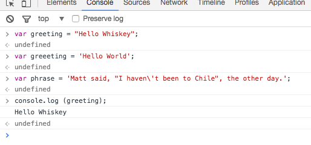
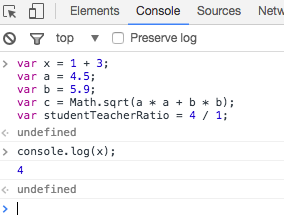

# Primitive Data Types 

Most of the variables so far stored _strings_. But JavaScript can work with other types of data as well. Let's take a look at the primitive data types.

JavaScript has 6 primitive data types, but we'll only talk about 5 of them. Here's what they look like:

*   string - `var greeting = "hello";`
*   number - `var favoriteNum = 33`;
*   boolean - `var isAwesome = true;`
*   undefined - `var foo;` or ` var setToUndefined = undefined;`
*   null - `var empty = null;`

JavaScript is known as a "weakly" typed language. What this means is that when you create variables and assign them to values, you do not have to specify the type of data you are working with. In statically (or strongly) typed languages, like Java and C++, you do need to specify the type.

Now let's look at data types a little more.

## strings

As we saw above, a string is a set of characters enclosed in quotes. A string can be defined using double quotes:

~~~javascript
var greeting = "Hello Whiskey";
~~~

or using single quotes:

~~~javascript
var greeeting = 'Hello World';
~~~

So what is the difference between the two ways of initializing a string? Well, first of all, if you want quotes in your string, it's nice to have another option to start and end the string:

~~~javascript
var phrase = 'Matt said, "I haven\'t been to Chile", the other day.';
~~~

What would happen if you try to use double quotes to create the previous string instead of using single quotes? Try it in your console.

Also notice that there is a backslash before the single quote in haven't. The backslash is called an escape character and it tells JavaScript that the single quote in the string should not be used to end the string. Try removing the backslash from the string and see what happens in your JavaScript console.

Try declaring the above variables in the chrome, and then log then:

## number

JavaScript numbers can be positive:

~~~javascript
var num = 5;
~~~

negative:

~~~javascript
var num = -25;
~~~

## decimal numbers:

~~~javascript
var piApproximation = 3.14159265;
~~~

and we can also do all of the math expressions you'd expect:

~~~javascript
var x = 1 + 3;
var a = 4.5;
var b = 5.9;
var c = Math.sqrt(a * a + b * b);
var studentTeacherRatio = 4 / 1;
~~~

If you need to do any kind of calculation in the application you're building, chances are you'll be relying heavily on the number type.

Declare and output these variables in the console:

## boolean

A boolean type can only be in one of two states, true or false. In other words:

~~~javascript
var pizzaIsGood = true;
~~~

~~~javascript
var pizzaIsBad = false;
~~~

Boolean types are a very useful tool for controlling our program. For example, if a user is signed in, you might want to show them a link to update their profile; but if a user is not logged in, you'd probably just want to show them a sign-in link. This sort of behavior, where the code that gets executed is conditioned on something else, happens all the time in programming. We'll learn more about how to deal with these situations in the next chapter.

### undefined

Any variable that is created in JavaScript that is not assigned a value is undefined:

~~~javascript
var noValue;  // The value here will be undefined
~~~

You can also explicitly set a variable to undefined:

~~~javascript
var favoriteFood = "Candy";
// Changed your mind
var favoriteFood = undefined;
~~~

## null

Null is not the same as undefined. It signifies an intentional absense of data.

~~~
var secondEmailAddress = null;
~~~

It is important to remember that `null` and `undefined` are different types in JavaScript. This can be a confusing feature of JavaScript, even for people who know other programming languages. The distinction can seem somewhat arbitrary when you're first learning the language, but as you get more comfortable the distinction will become clearer. 

## Figuring out a variable's type in JavaScript

In JavaScript, we have a keyword called `typeof` that returns the type of the variable. While this seems pretty fool-proof, there are some quirks that we should be aware of. In the Chrome console, let's type out each one of these:

*   `typeof "";` - "string"
*   `typeof 5;` - "number"
*   `typeof false;` - "boolean"
*   `typeof undefined;` - "undefined"
*   `typeof null;` // hmmm, this is not what we expect, it returns "object"!

## Converting between types

Very often you'll need to convert a value from one type to another. For example, maybe you want to do some math on a couple of numbers, but you get the numbers from a form and they have a value of string. In some cases JavaScript will change types implicitly, in a process that's often referred to as (implicit) type coercion. We'll discuss the details of this later.

For now, though, let's take a look at some ways to explicitly change the type of a value. Here are a few examples:

## Converting to a string: `toString`

The `toString` method will convert any value which is not undefined or null into a string. Here are a couple of examples:

~~~javascript
var num = 5;
var bool = true;

num.toString(); // "5";
bool.toString(); // "true";
~~~

## Converting to a number

There are several ways you can convert a value to a number. One way is to parse the number, using `parseInt` or `parseFloat`: each function will look at a string from left to write and try to make sense of the characters it sees as numbers. Here are some examples:

~~~javascript
parseInt("2"); // 2
parseFloat("2"); // 2
parseInt("3.14"); // 3
parseFloat("3.14"); // 3.14
parseInt("2.3alkweflakwe"); // 2
parseFloat("2.3alkweflakwe"); // 2.3
parseInt("w2.3alkweflakwe"); // NaN (not a number)
parseFloat("w2.3alkweflakwe"); // NaN (not a number)
~~~

## Exercise : 

In the `first.js` file created in step 1, to do the following:

- Prompt the user for their favorite color
- Prompt the user fir their favorire number

Log these values to the console along with a friendly message.

Load `first.html` in chrome and keep an eye on the console to see that the message is being displayed.
