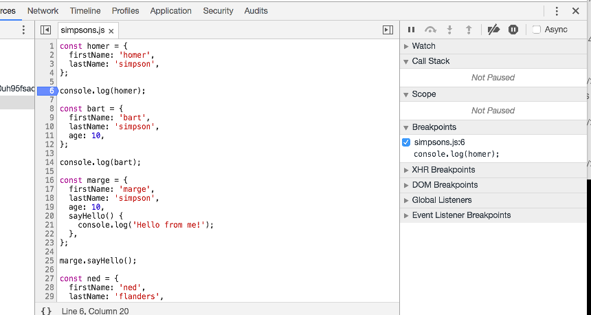
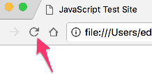
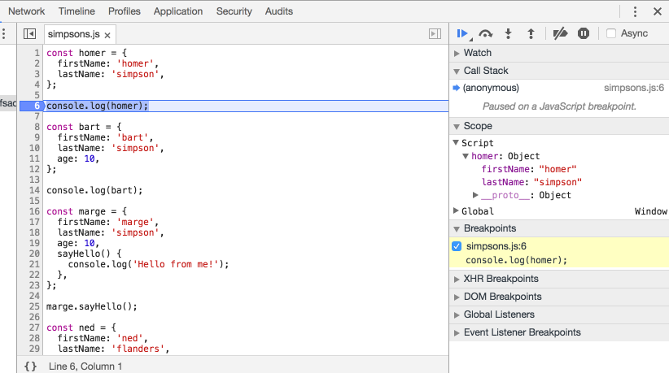
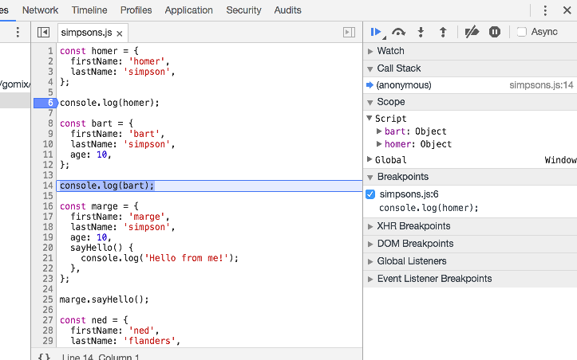
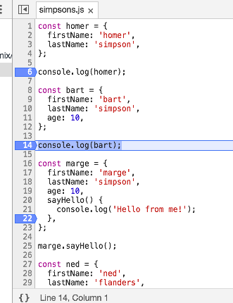

# Chrome Debugger

Use this copy of the `simpsons.js` file (copy/paste in, replacing your content:

## simpsons.js

~~~javascript
const homer = {
  firstName: 'homer',
  lastName: 'simpson',
};

console.log(homer);

const bart = {
  firstName: 'bart',
  lastName: 'simpson',
  age: 10,
};

console.log(bart);

const marge = {
  firstName: 'marge',
  lastName: 'simpson',
  age: 10,
  sayHello() {
    console.log('Hello from me!');
  },
};

marge.sayHello();

const ned = {
  firstName: 'ned',
  lastName: 'flanders',
  age: 45,
  speak() {
    console.log('How diddley do? says ' + this.firstName);
  },
};

ned.speak();
~~~

In chrome, open `simpsons.html`  again now - and also open developer tools:

Select the `Sources` tab, and then select `simpsons.js`:

Now, double click in the margin on line 6 - so that a blue arrow appears:

Reload the page (press the reload button in the browser tool bar)

... and look carefully at the view now presented:

Notice that the object homer has appeared on the right panel above.

Now try the following - press the `Step over..` button indicated below:

This will move the blue indicator on in the script:

Press this `Step over` button again a few times. Monitor the changes in the right hand panel as you do this. 

Reload the page again - step through the script line by line, carefully looking at the right hand pane,.

# Exercise

Experiment with creating and removing the blue indicators in the margin:

These are called `breakpoints`, and they allow you to stop the program at the point indicated. You can remove a breakpoint by double clicking in the margin. 

Try to understand what happens when you press the reload button on the browser. Also, explore the right hand pane in the developer tools console

