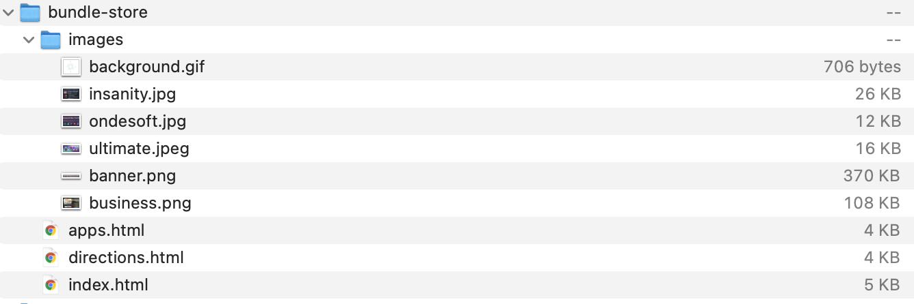
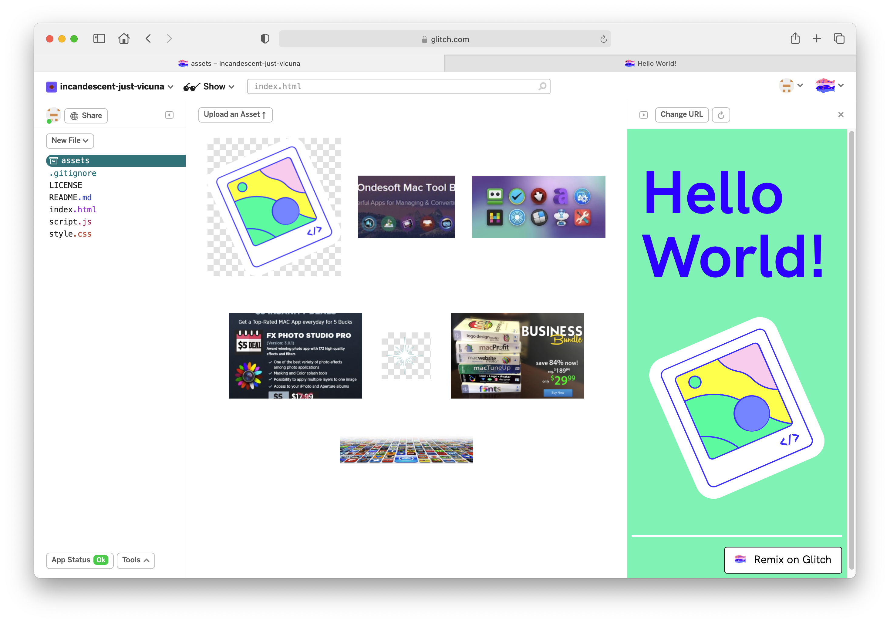
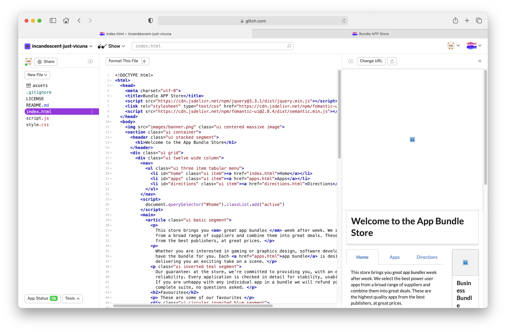
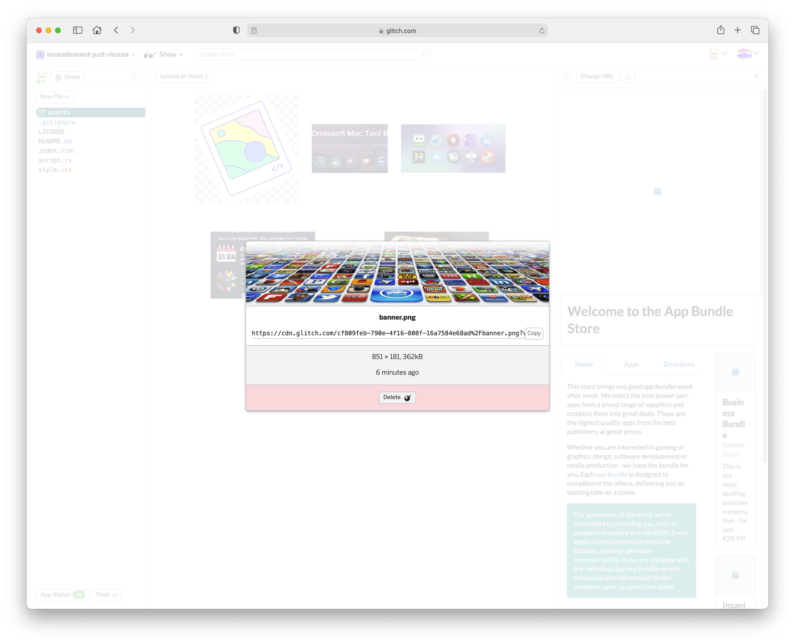
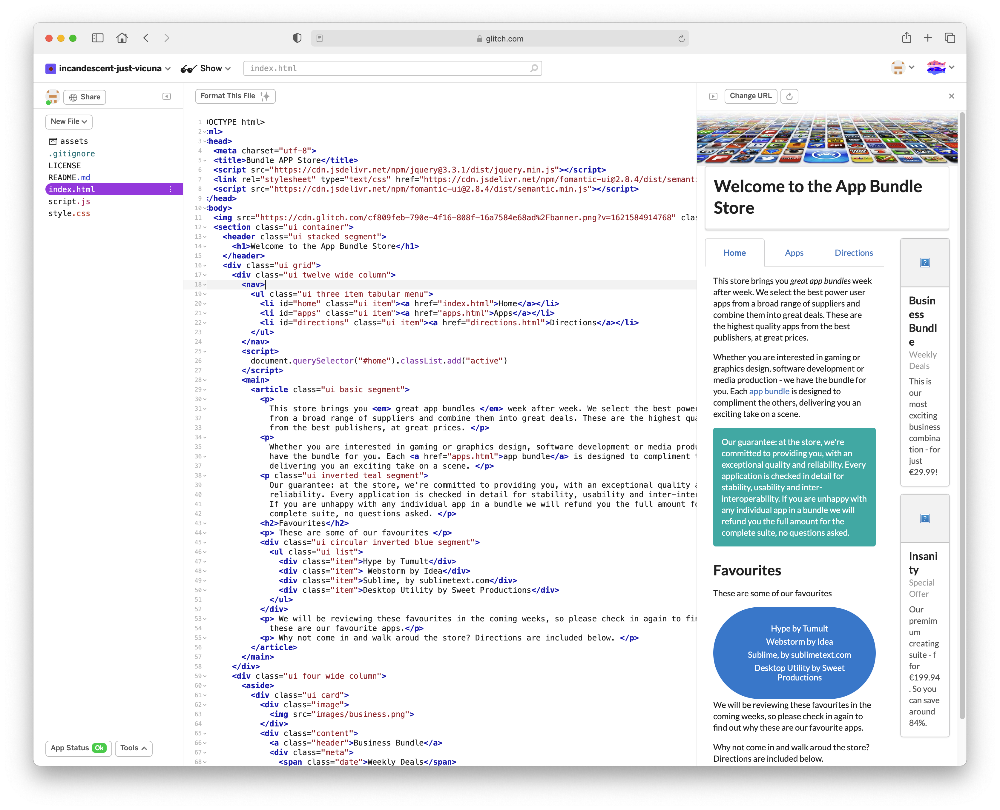
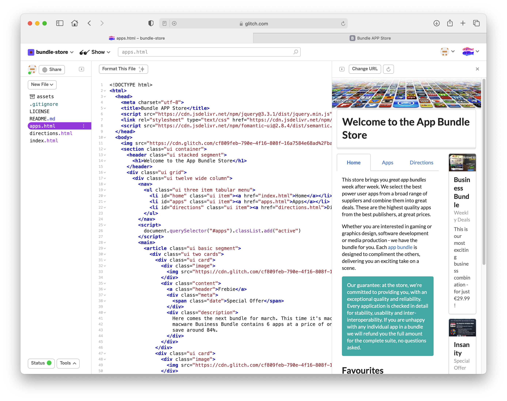
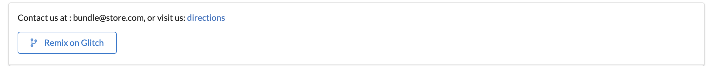

# Project Structure and Editing

This is an archive of project from our previous course:

- [Bundle Store](archives/bundle-store.zip)

This site is a Fomantic UI web site - the [App Bundle Store](archives/bundle-store/index.html). We can host this project in glitch (in the project you have just created).

First, download the zip file above and expand:

Then, drag an drop the images to the assets folder on your project:

Replace the index.html with index from the bundle store project:

Notice the banner image does not appear - we will need to manually insert the correct image links. Back in the assets folder, select the banner image:

And copy the url. Replace the current banner image in index.html with this link:

There are 2 other images to be linked correctly.

Now incorporate the app.html and directions.html pages into the project. 

This is the running project:

- https://bundle-store.glitch.me

Navigate to the above web site - and notice we have an additional button in the footer:

Press this button - and the above project will be cloned (as a separate project) into your workspace. It will also be deployed to a new url.

This is the source for the button above:

~~~html
        <a class="ui basic blue button" href="https://glitch.com/edit/#!/remix/bundle-store">
           <i class="fork icon"></i> 
          Remix on Glitch
        </a>
~~~

