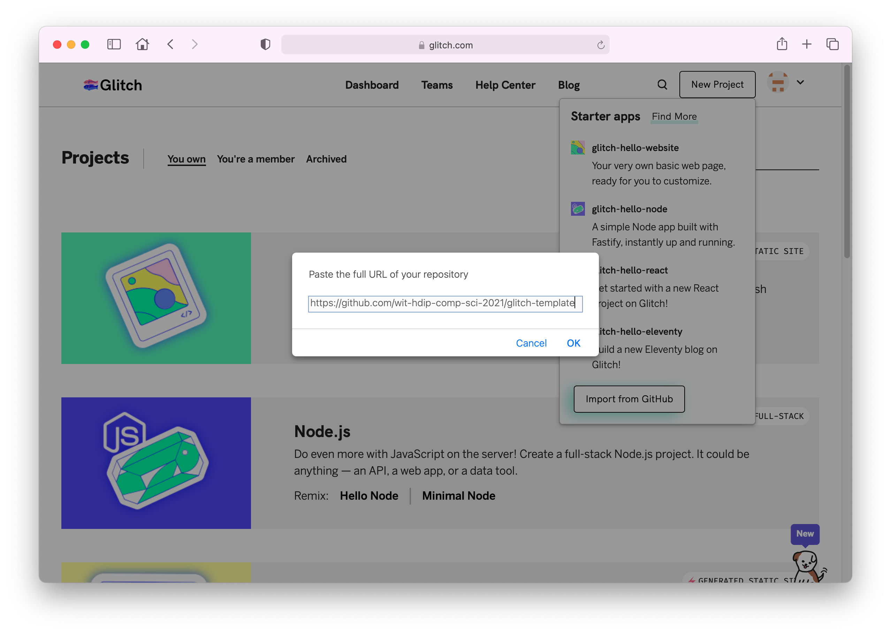
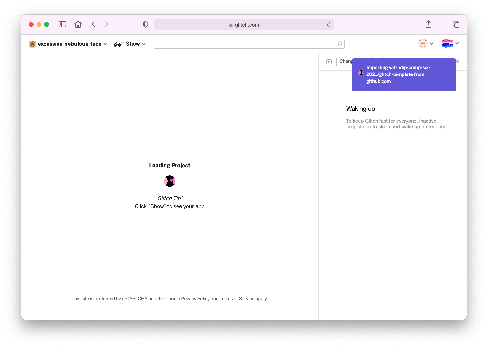
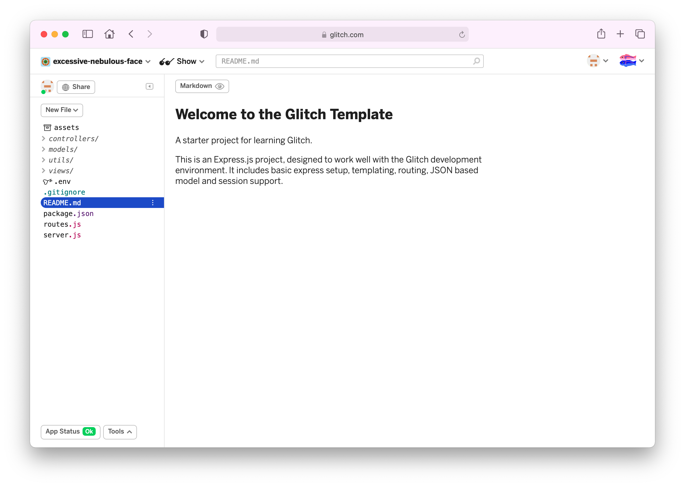

# Create Project

From the menus select `New Project`:


Press `Import from Github`:



In the dialog, enter this repo:

```bash
https://github.com/wit-hdip-comp-sci-2021/glitch-template
```

It will take a few seconds to load:



Eventually the project will be imported:



This mirrors the procedure we used to create a Play project in Web Development - we cloned an existing project as a starting point.

The main difference is that the entire project source is hosted on the glitch service. Also, the project is automatically, continuously deployed. This is accessed via the `Show` button:


Displaying the app in a new window:


Or side-by-side in the same browser window:


This app is now live, and accessible to anyone with the link. It is more or less the same UX as the starter Play app we used.

Whenever we edit the source, if there are no syntax errors, then the changes are immediately available in the deployed app.

The application is written in Javascript, not Java. However, much of your experience with Java/Play will be relevant as we explore this new 'Development Stack'. Some of the key differences:

- Programming Language [Javascript](https://developer.mozilla.org/en-US/docs/Web/JavaScript) (instead of Java)
- Web Framework is [Express](https://expressjs.com/) (instead of Play)
- Templating system is [handlebars](https://handlebarsjs.com/) (instead of Play's system)

This means if we wish to convert our Play applications to Glitch they will need to be rebuilt. However, there are many similarities:

- The Model/View/Controller pattern is carried over more or less intact
- The UX - based in HTML5 + Semantic-UI/Fomantic-UI is familiar
- Routes + router configuration follows a similar structure to Play

This may imply that if you are reasonably comfortable with the type of Play/Java applications we have been building - then the main challenge in moving to Glitch will be learning Javascript.

The TODO labs are a 'deep dive' into Glitch development - based on the TODO labs we completed in Play. We will still need to learn the basics of Javascript - but this lab will be a quick tour (without detailed explanations) of how to build the todo app in this environment. When you have completed the Javascript learning paths in the coming weeks, you might return to the todo labs again with a deeper understanding of Javascript.