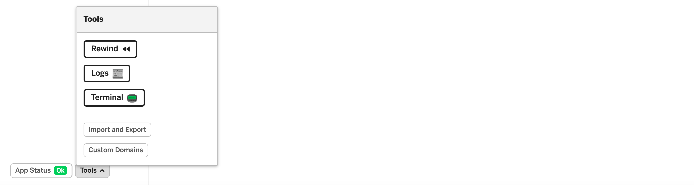
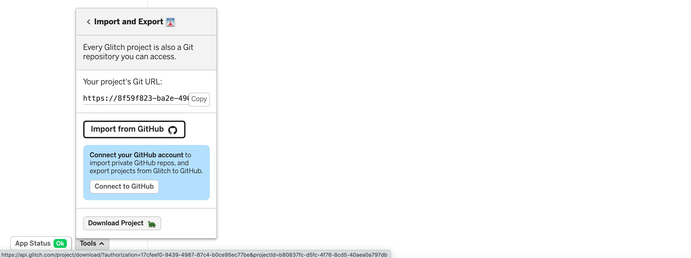
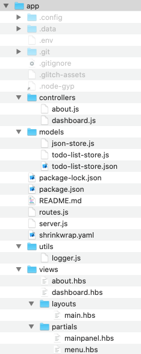
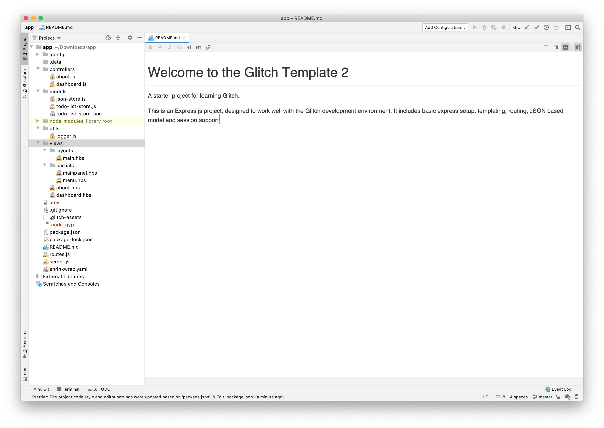
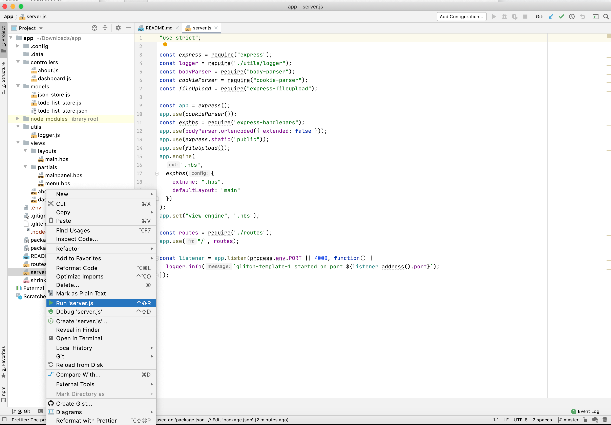
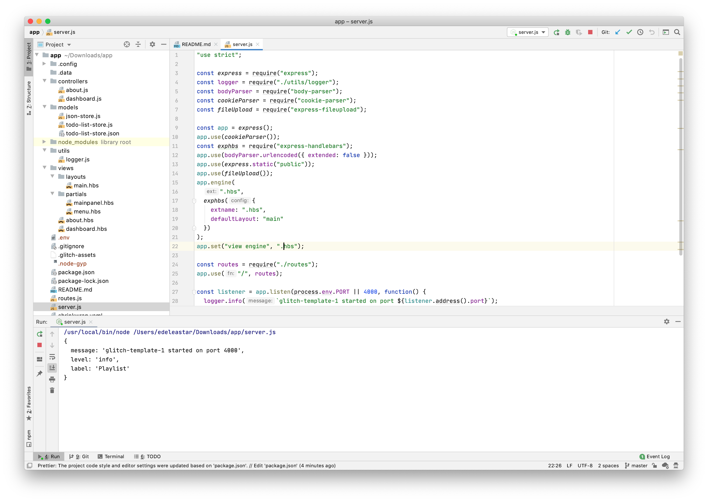
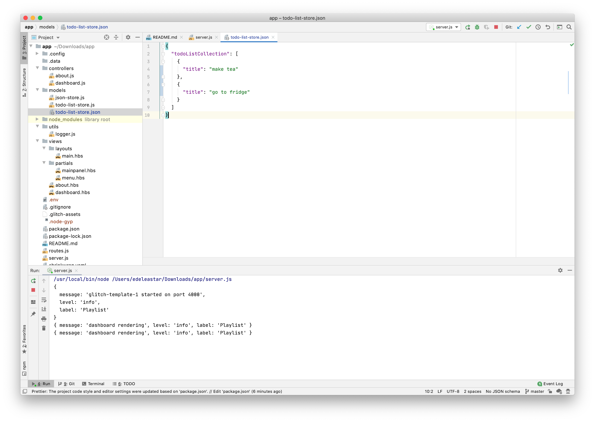

# Download Project

In Glitch, select the Tools menu :



and then `Import and Export`



Select `Download Project`. This will give you a local archive:



Before you can open this project in Webstorm, you will need to first initialise it correctly (you might recall the `play initialize` step when we were working with Play/Java).

For this type of project, the procedure is a little different. Open a command prompt, and change to the to the folder containing your expanded archive, and enter the following command:

```bash
npm install
```

It should respond with something like this:

```bash
$ npm install
added 126 packages from 119 contributors and audited 126 packages in 1.942s

3 packages are looking for funding
  run `npm fund` for details

found 0 vulnerabilities
```

Now, open the project in Webstorm:



The Webstorm UX us quite similar to IDEA.

To run the project, Right click on the server.js file, and select `run`:



This will reconfigure the IDE:



The app should now be running locally on this address:

- <http://localhost:4000/>

One advantage of running the application locally is that the todo-list-store.json model file will be updated immediately:


