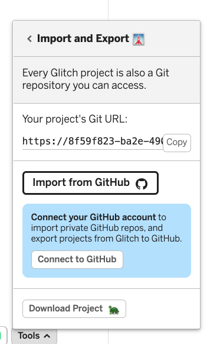

# Exercises

This is the project at this stage:

- <https://github.com/wit-hdip-comp-sci-2021/todo-list-1>

## Exercise 1:

Download, expand and open and run this project on your workstation using WebStorm.

## Exercise 2: (Optional - more challenging)

See if you can get the project onto your github account, and then import the project into Glitch from there.

This option is available from the Tools menu in Glitch:

