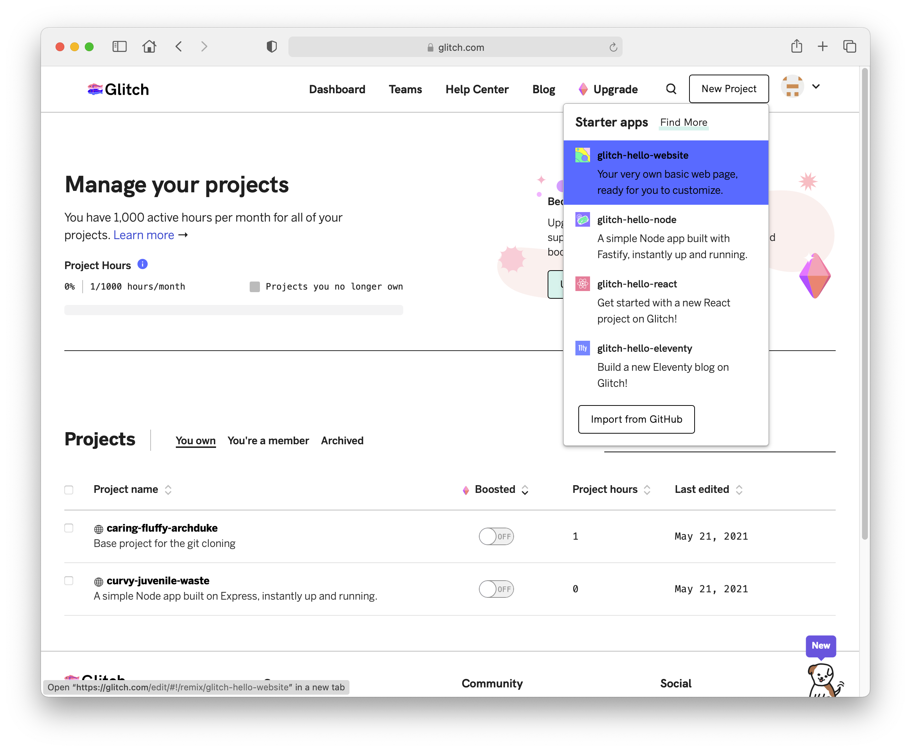
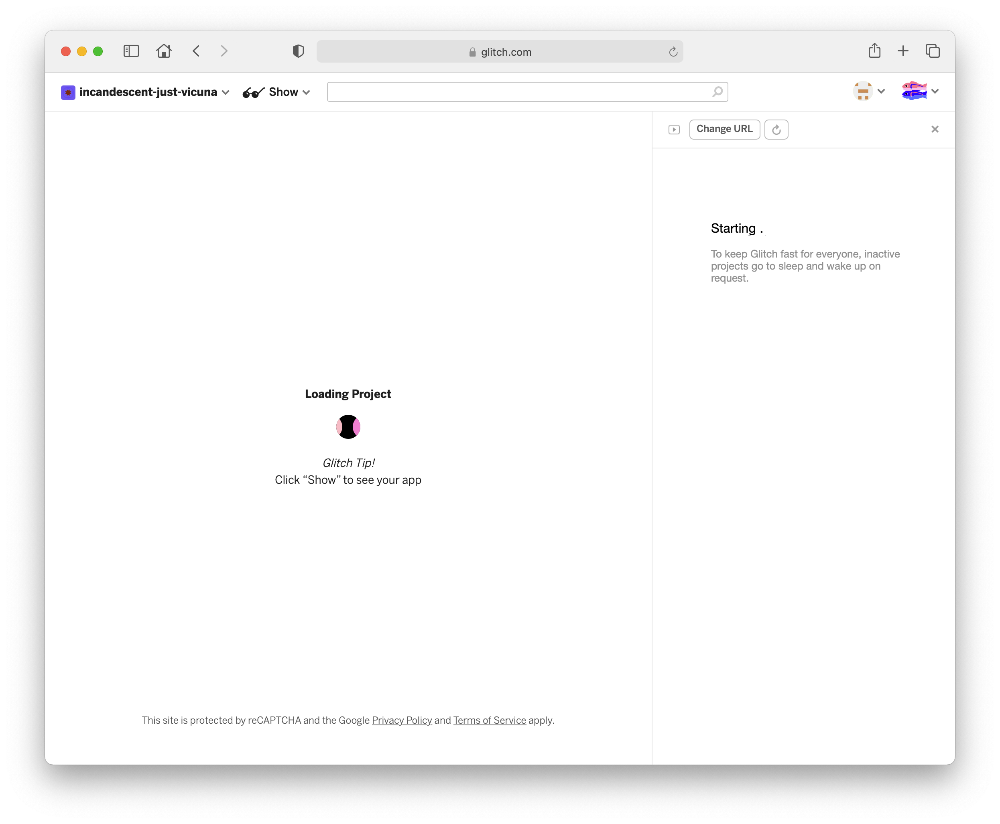
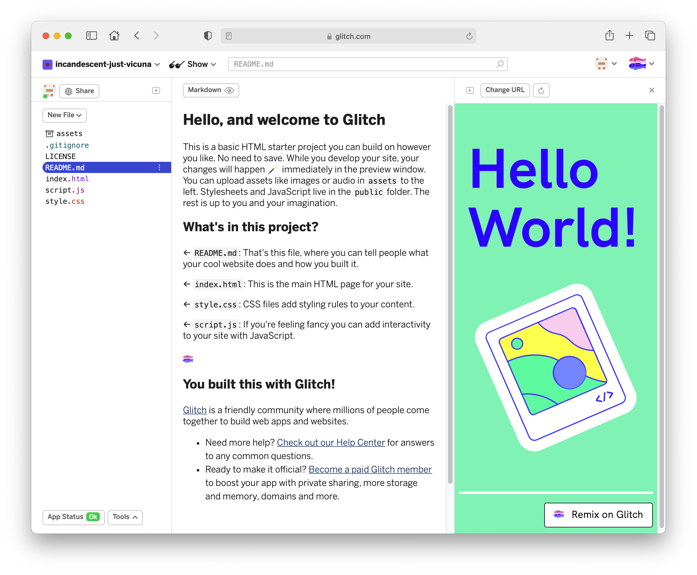
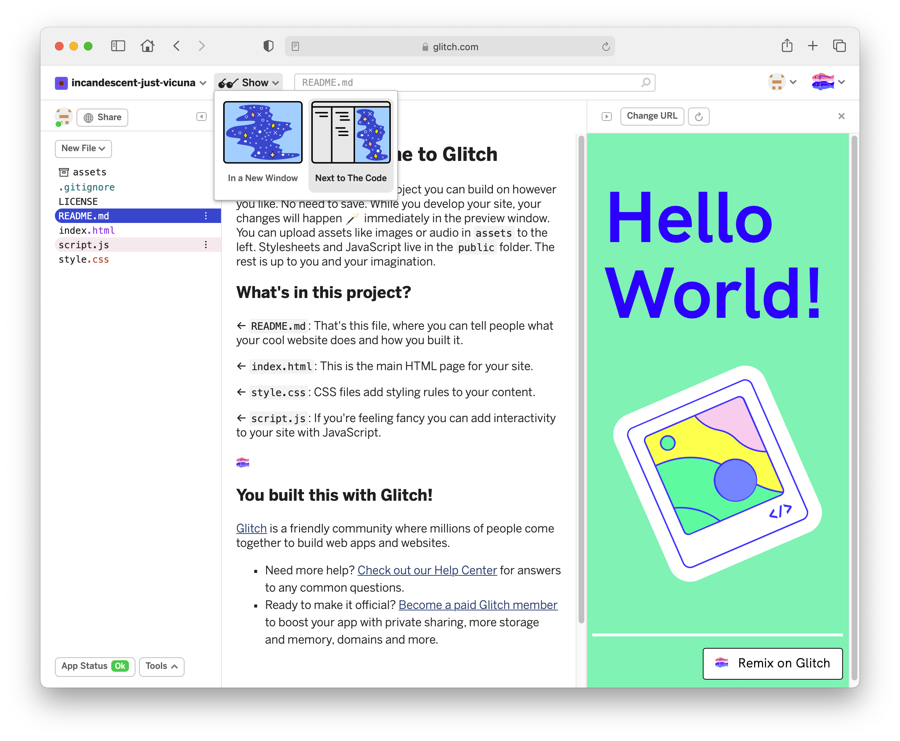
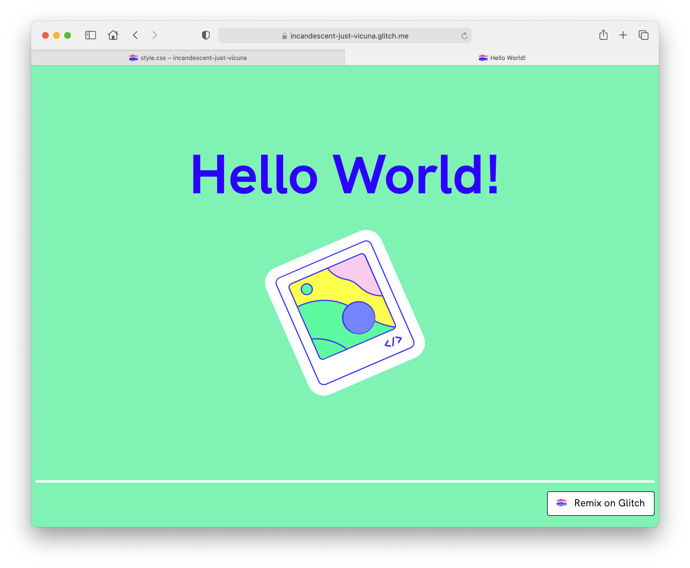

# Create Project

Create a new project and Select `glitch-hello-website`

This will load a new project:

Finally once loaded:

Look carefully at the page now - it is something like a web based IDE, with the project folder/files along the left and the selected file editable in the main panel. Select some of the files and look at their contents.

Press the `Show` button:

If you select 'In a New Window' - then you will be able to view the web site as a user would browse to it:

