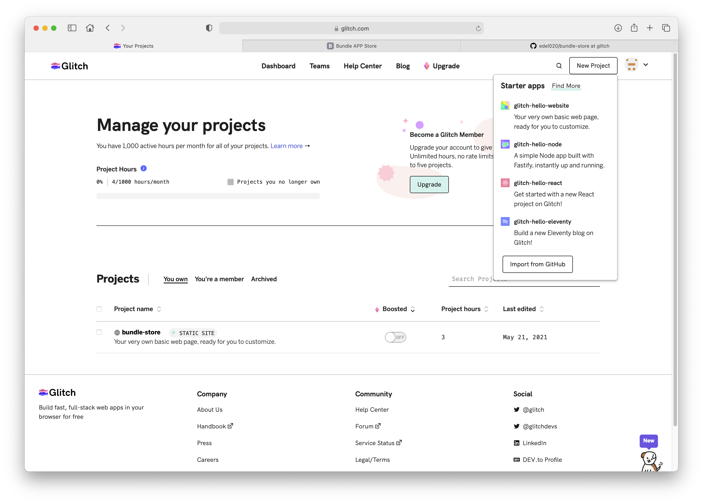

# Exercises

Explore the other project types:

Each of these project types:

- Web Site
- Node
- React
- Eleventy

... require more background knowledge on the frameworks these projects use. The focus of this course will be on the `Node` category - which most closely matches our work to date on the Play Java framework.

