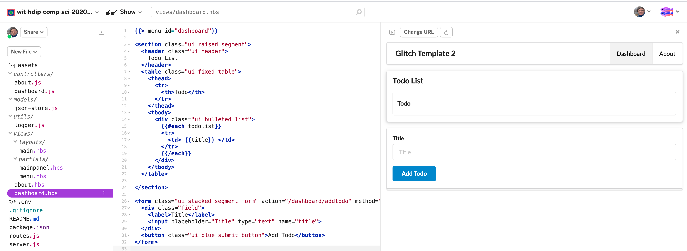

# Dashboard View

Lets change the dashboard now to reflect to Todo application we have previously developed:

## views/dashboard.hbs

```html
{{> menu id="dashboard"}}

<section class="ui raised segment">
  <header class="ui header">
    Todo List
  </header>
  <table class="ui fixed table">
    <thead>
      <tr>
        <th>Todo</th>
      </tr>
    </thead>
    <tbody>
      <div class="ui bulleted list">
        {{#each todolist}}
        <tr>
          <td>{{title}}</td>
        </tr>
        {{/each}}
      </div>
    </tbody>
  </table>
</section>

<form class="ui stacked segment form" action="/dashboard/addtodo" method="POST">
  <div class="field">
    <label>Title</label>
    <input placeholder="Title" type="text" name="title" />
  </div>
  <button class="ui blue submit button">Add Todo</button>
</form>
```



This form is not backed by any model yet - we will introduce one in the next step.
