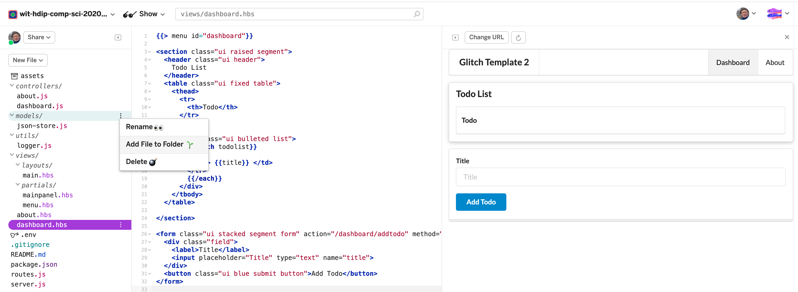
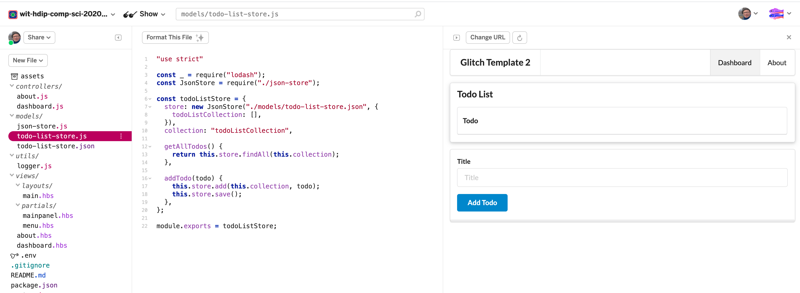

# Todo Model

We are now working in Javascript - which will be the language we use instead of Java on this platform. We will also be using a notation called JSON - Javascript Object Notation. This is approximately equivalent to YAML which we used to seed the database in the Play applications.

In the models folder, bring in these two new files:

## models/todo-list-store.js

```javascript
"use strict";

const _ = require("lodash");
const JsonStore = require("./json-store");

const todoListStore = {
  store: new JsonStore("./models/todo-list-store.json", {
    todoListCollection: [],
  }),
  collection: "todoListCollection",

  getAllTodos() {
    return this.store.findAll(this.collection);
  },

  addTodo(todo) {
    this.store.add(this.collection, todo);
    this.store.save();
  },
};

module.exports = todoListStore;
```

## models/todo-list-store.json

```
{
  "todoListCollection": [
  ]
}
```

Use the context menu on each folder to add the files:



Make sure the files are correctly named and in the correct folder:


