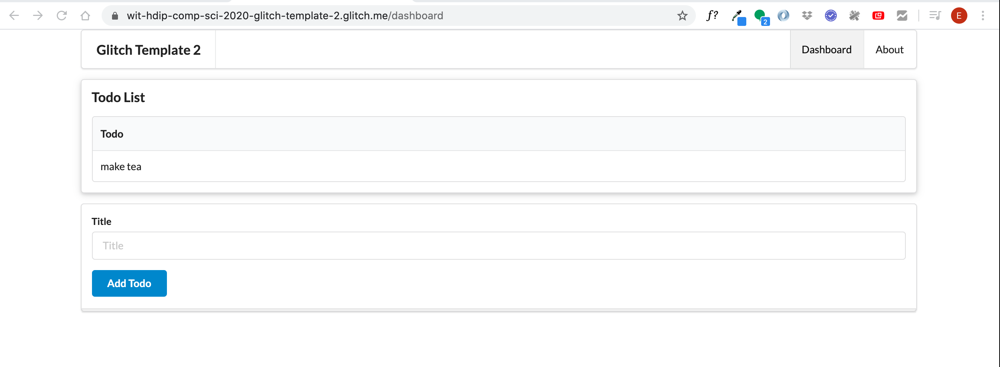
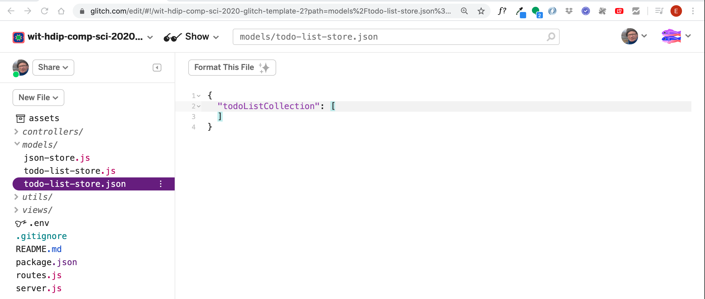

# Dashboard Controller

Now we can build the correct Dashboard controller:

## controllers/dashboard.js

```javascript
"use strict";

const logger = require("../utils/logger");
const todoListStore = require("../models/todo-list-store");
const uuid = require("uuid");

const dashboard = {
  index(request, response) {
    logger.info("dashboard rendering");
    const viewData = {
      title: "Template 1 Dashboard",
      todolist: todoListStore.getAllTodos(),
    };
    response.render("dashboard", viewData);
  },

  addTodo(request, response) {
    const todo = {
      title: request.body.title,
    };
    todoListStore.addTodo(todo);
    response.redirect("/dashboard");
  },
};

module.exports = dashboard;
```

Finally, to get this to work, we add the route:

## routes.js

```javascript
router.post("/dashboard/addtodo", dashboard.addTodo);
```

You should now be able to add todos:



These items will be added to the file `todo-list-store.json`:



However, as shown above, there can be quite a delay in the editor being updated with the new entries. In fact, you may not see an accurate reflection in this view until the session with glitch has been restarted.
