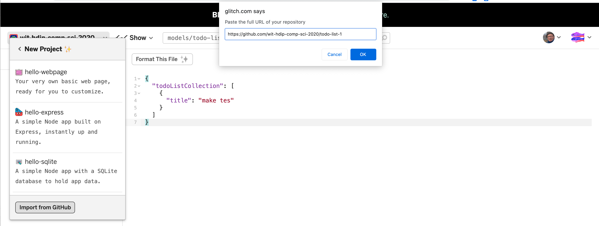

# Setup

This is the project as completed from the last lab:

- <https://github.com/wit-hdip-comp-sci-2021/todo-list-1>

Start by creating a new Glitch project, and importing the above

Make sure the project runs as expected, allowing you to add todo items.
