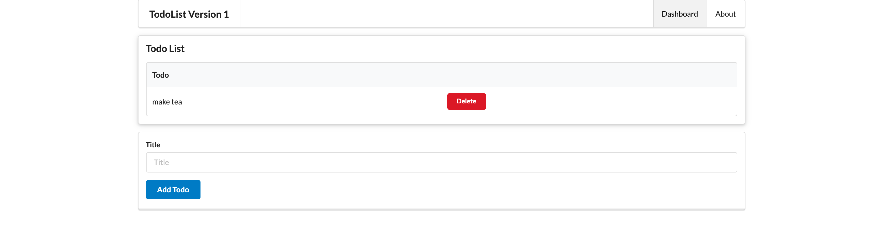

# Delete Button

We begin by introducing a delete button onto the dashboard:

## app/views/dashboard.hbs

```html
...
<table class="ui fixed table">
  <thead>
    <tr>
      <th>Todo</th>
      <th></th>
    </tr>
  </thead>
  <tbody>
    <div class="ui bulleted list">
      {{#each todolist}}
      <tr>
        <td>{{title}}</td>
        <td>
          <a href="/dashboard/deletetodo/{{id}} " class="ui tiny red button">
            Delete
          </a>
        </td>
      </tr>
      {{/each}}
    </div>
  </tbody>
</table>
...
```

This version has an additional button on each todo:



This should facilitate deletion of todos.

We need a supporting route:

## routes.js

```
...
router.get("/dashboard/deletetodo/:id", dashboard.deleteTodo);
...
```

This will not work (yet) however.
