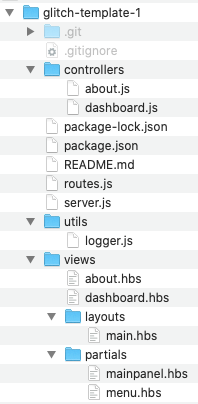
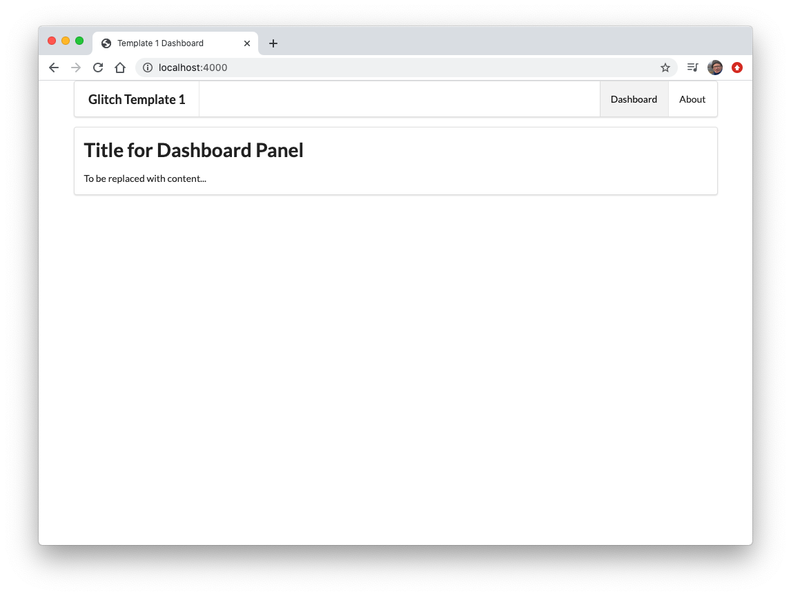

# Setup Project

Each lab in this series will start with a link to a project on github to use as the starting point. If we are to use Webstorm instead of Glitch, then the first step will be to clone this repo.

For example:

~~~bash
git clone https://github.com/wit-hdip-comp-sci-2021/glitch-template
~~~

This will respond with:

~~~bash
Cloning into 'glitch-template'...
remote: Enumerating objects: 21, done.
remote: Counting objects: 100% (21/21), done.
remote: Compressing objects: 100% (18/18), done.
remote: Total 21 (delta 1), reused 21 (delta 1), pack-reused 0
Unpacking objects: 100% (21/21), done.
~~~

This will create a local copy of the project:

This is identical to the project we would have imported into Glitch.

When cloning a project like this - the first step is always to run the following command:

~~~bash
npm install
~~~

This `must` be run from inside the project folder.

This will respond with:

~~~bash
added 126 packages from 119 contributors and audited 126 packages in 1.359s

3 packages are looking for funding
  run `npm fund` for details

found 3 low severity vulnerabilities
  run `npm audit fix` to fix them, or `npm audit` for details

   ╭────────────────────────────────────────────────────────────────╮
   │                                                                │
   │      New patch version of npm available! 6.14.4 → 6.14.5       │
   │   Changelog: https://github.com/npm/cli/releases/tag/v6.14.5   │
   │               Run npm install -g npm to update!                │
   │                                                                │
   ╰────────────────────────────────────────────────────────────────╯
~~~

This project is a web application, and the following command will run the app:

~~~bash
npm start
~~~

This will respond with:

~~~bash

> glitch-template start /Users/edeleastar/repos/modules/hdip/2020/prj/web/glitch-template-1
> node server.js

{
  message: 'glitch-template-1 started on port 4000',
  level: 'info',
  label: 'Playlist'
}
~~~

The application will now be running on:

- <http://localhost:4000/>

To stop the project, enter Ctrl-C in the terminal, returning the command prompt.

