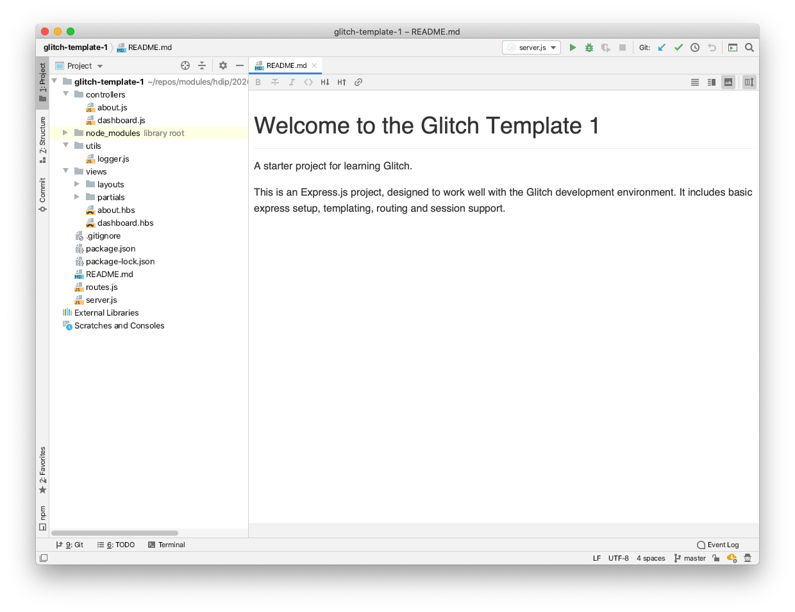
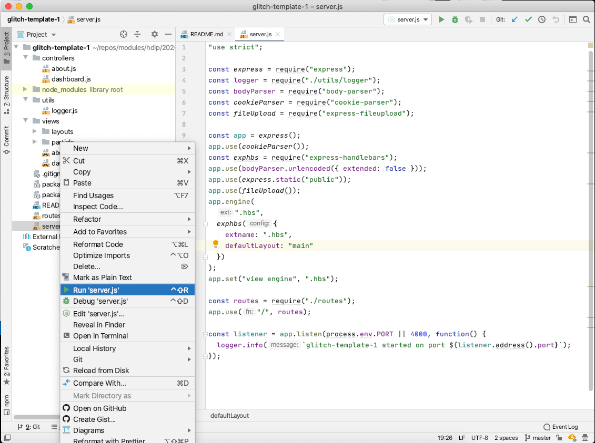
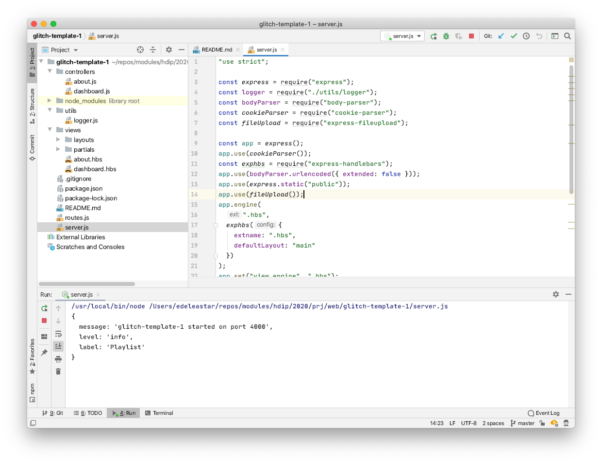
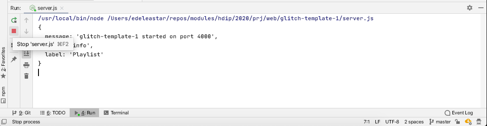

# WebStorm

Now, open the project in WebStorm:

The WebStorm UX us quite similar to IDEA.

To run the project, Right click on the server.js file, and select `run`:

This will reconfigure the IDE:

The app should now be running locally on this address:

- <http://localhost:4000/>

To stop the app, press the Stop Server (red) button:

You can rerun the app again via the rerun server button:

