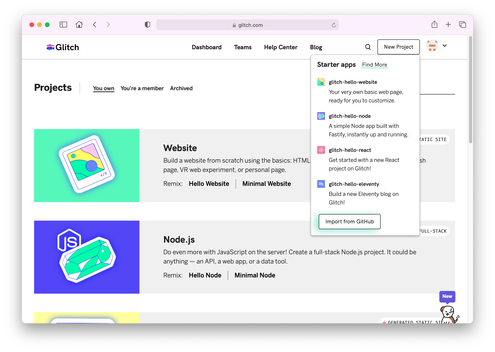
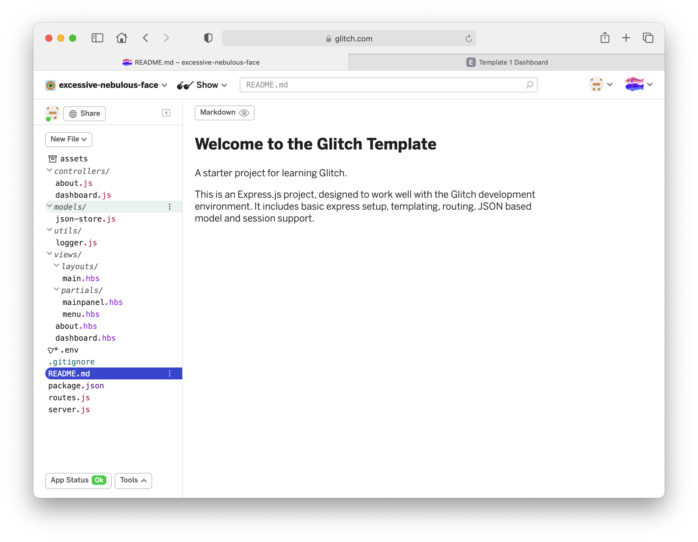
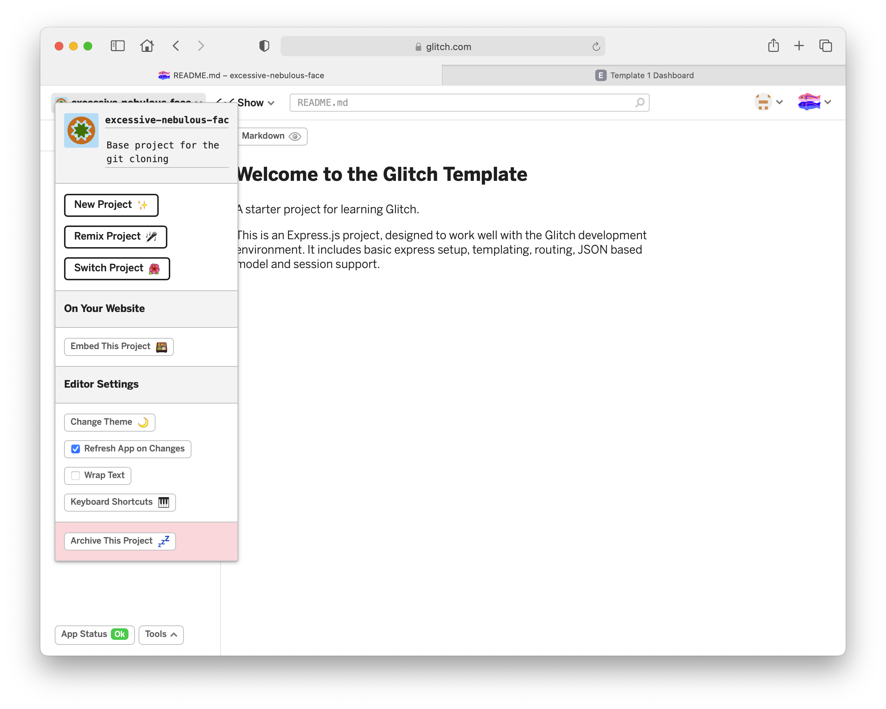
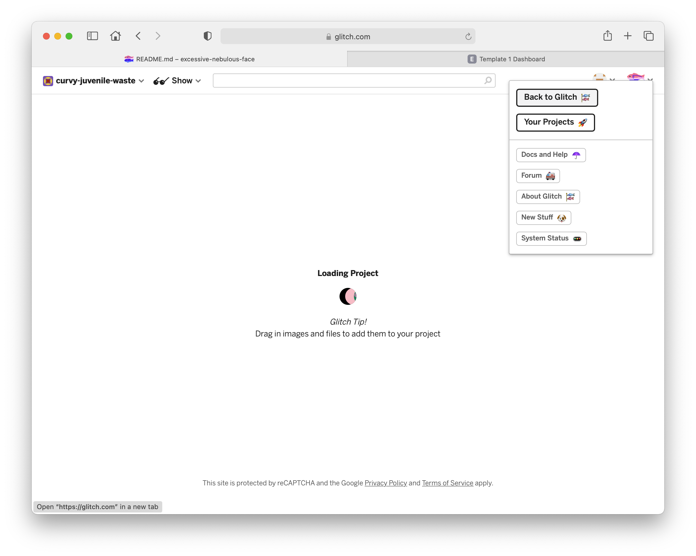
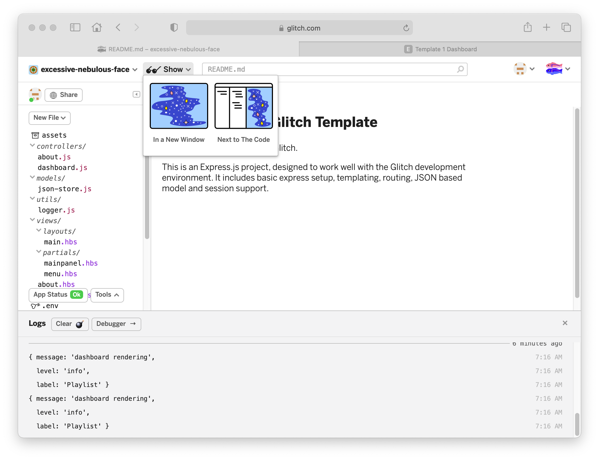
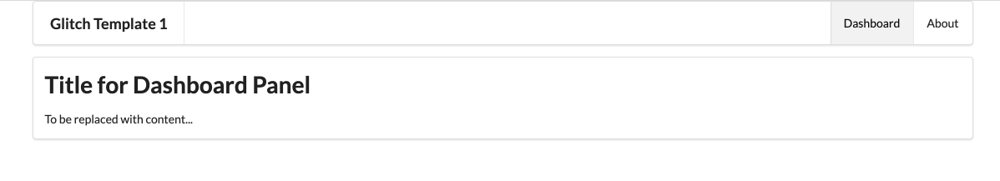

# Template 1

Create a new project in Glitch - selecting `Import from Github`:

In the subsequent dialog, enter this repo url:

~~~bash
https://github.com/wit-hdip-comp-sci-2021/glitch-template
~~~

Press ok to import the project.

### If there is an error...

Occasionally, the import process will stall, and the above perspective will not appear correctly. If this happens, the simplest option is to:

- Archive the current (partially imported project) 

- Select 'Back to Glitch':

And then proceed to clone from github again as above. The anomaly that caused the stall will usually not occur twice in a row.

### View Logs

Now, select Tools->Logs (a button along the end of the screen), and turn on logs:

Now press the `Show ->In a new Window` button

This should reveal the application running:

Explore the (small) number of views.
