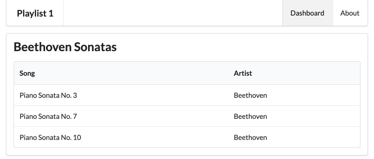
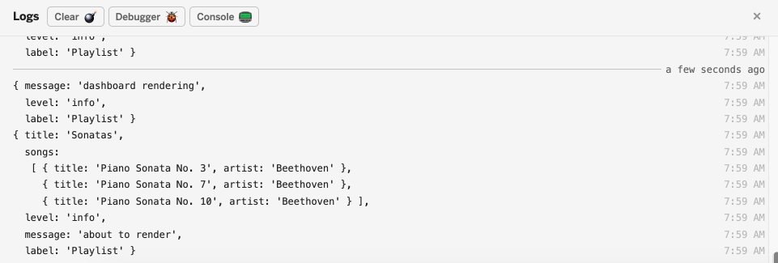

# Dynamic Playlist

The app as we have it now could have been completely built as a static web site. However, the framework and tools we have used in this version enable us to evolve this static site into an interactive web app.

The first step is to eliminate some of the static content from the listsongs partial. In  listsongs.hbs replace the table with the following):

## views/partials/listsongs.hbs

~~~html
<table class="ui table">
  <thead>
    <tr>
      <th>Song</th>
      <th>Artist</th>
    </tr>
  </thead>
  <tbody>
    {{#each playlist.songs}}
      <tr>
        <td>
          {{title}}
        </td>
        <td>
          {{artist}}
        </td>
      </tr>
    {{/each}}
  </tbody>
</table>
~~~

In the above, we are `iterating` over an `array` of `songs` inside a `playlist` object:

~~~html
{{#each playlist.songs}}
  <tr>
    <td>
      {{title}}
    </td>
    <td>
      {{artist}}
    </td>
  </tr>
{{/each}}
~~~

This playlist object must be passed to the view for this to work.

In the `dashboard.js` controller, we can define a playlist object in Javascript (place this definition prior to the dashboard object definition):

## controllers/dashboard.js

~~~js
...
const sonatas = {
  title: 'Sonatas',
  songs: [
    {
      title: 'Piano Sonata No. 3',
      artist: 'Beethoven',
    },
    {
      title: 'Piano Sonata No. 7',
      artist: 'Beethoven',
    },
    {
      title: 'Piano Sonata No. 10',
      artist: 'Beethoven',
    },
  ],
};

...
~~~

Examine the above structure carefully. This is a javascript `object literal`. It consists of :

- a title field containing the string `Sonatas`
- an array called `songs`, which contains 3 objects, each of which has:
    - title
    - artist

The index method in dashboard.js file can now be modified to pass this list to the view:

## controllers/dashboard.js

~~~js
  index(request, response) {
    logger.info("dashboard rendering");
     const viewData = {
       title: 'Playlist 1 Dashboard',
       playlist: sonatas
    };
    response.render("dashboard", viewData);
  }
~~~

Make sure the playlist is displayed, showing the contents of the sonatas array:

This is the complete dashboard module at this stage:

## controllers/dashboard.js

~~~javascript
"use strict";

const logger = require("../utils/logger");

const sonatas = {
  title: 'Sonatas',
  songs: [
    {
      title: 'Piano Sonata No. 3',
      artist: 'Beethoven',
    },
    {
      title: 'Piano Sonata No. 7',
      artist: 'Beethoven',
    },
    {
      title: 'Piano Sonata No. 10',
      artist: 'Beethoven',
    },
  ],
};

const dashboard = {
  index(request, response) {
    logger.info("dashboard rendering");
     const viewData = {
       title: 'Playlist 1 Dashboard',
       playlist: sonatas
    };
    response.render("dashboard", viewData);
  }
};

module.exports = dashboard;
~~~

## Logs

We can take advantage of the logger to display the playlist before we render it:

~~~js
index(request, response) {
  logger.info('dashboard rendering');
  const viewData = {
    title: 'Playlist Dashboard',
    playlist: sonatas,
  };
  logger.info('about to render', sonatas);
  response.render('dashboard', viewData);
},
~~~

You should see something like this in the logs:

