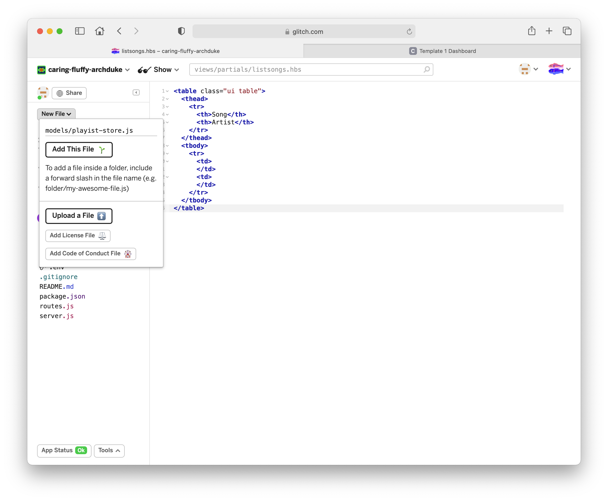

# playlist-store

We would like to manage the playlists separately from the controller, so that we can eventually introduce multiple playlists.

To prepare for this, create a new javascript module your app. Call it `playlist-store.js` in a  `models` folder. In Glitch, you can enter a full path, including a new directory when adding a file:

## models/playlist-store.js

~~~js
'use strict';

const logger = require('../utils/logger');

const sonatas = {
  title: 'Beethoven Sonatas',
  songs: [
    {
      title: 'Piano Sonata No. 3',
      artist: 'Beethoven',
    },
    {
      title: 'Piano Sonata No. 7',
      artist: 'Beethoven',
    },
    {
      title: 'Piano Sonata No. 10',
      artist: 'Beethoven',
    },
  ],
};

module.exports = sonatas;
~~~

Dashboard can then be simplified:

## controllers/dashboard.js

~~~js
'use strict';

const logger = require('../utils/logger');
const sonatas = require('../models/playlist-store.js');

const dashboard = {
  index(request, response) {
    logger.info('dashboard rendering');
    const viewData = {
      title: 'Playlist Dashboard',
      playlist: sonatas,
    };
    logger.info('about to render', sonatas);
    response.render('dashboard', viewData);
  },
};

module.exports = dashboard;
~~~

Notice in the above that we are importing the sonatas from the playlist-store module. Otherwise, the dashboard is unchanged.
