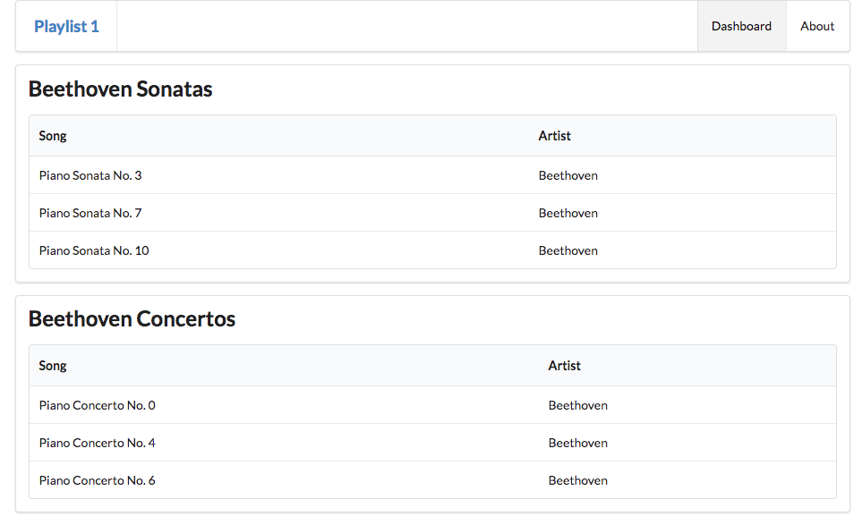

# Multiple playlists

Here is a new version of `playlist-store.js`:

## models/playlist-store.js

~~~javascript
'use strict';

const logger = require('../utils/logger');

const sonatas = {
  title: 'Beethoven Sonatas',
  songs: [
    {
      title: 'Piano Sonata No. 3',
      artist: 'Beethoven',
    },
    {
      title: 'Piano Sonata No. 7',
      artist: 'Beethoven',
    },
    {
      title: 'Piano Sonata No. 10',
      artist: 'Beethoven',
    },
  ],
};

const concertos = {
  title: 'Beethoven Concertos',
  songs: [
    {
      title: 'Piano Concerto No. 0',
      artist: 'Beethoven',
    },
    {
      title: 'Piano Concerto  No. 4',
      artist: 'Beethoven',
    },
    {
      title: 'Piano Concerto  No. 6',
      artist: 'Beethoven',
    },
  ],
};

const playlistCollection = [sonatas, concertos];

module.exports = playlistCollection;
~~~

Here we are defining 2 playlists :

- sonatas
- concertos

... and then an array called `playlistCollection`, which contains these two:

~~~js
const playlistCollection = [sonatas, concertos];
~~~

This is the object that is then exported:

~~~js
module.exports = playlistCollection;
~~~

In a revised dashboard, we import this object, and pass it to the view:

## controllers/dashboard.js

~~~javascript
'use strict';

const logger = require('../utils/logger');
const playlistCollection = require('../models/playlist-store.js');

const dashboard = {
  index(request, response) {
    logger.info('dashboard rendering');
    const viewData = {
      title: 'Playlist Dashboard',
      playlists: playlistCollection,
    };
    logger.info('about to render', playlistCollection);
    response.render('dashboard', viewData);
  },
};

module.exports = dashboard;
~~~

The dashboard view will have to be rewritten to now display a collection of playlists (we no longer use the listsongs.hbs partial in the dashboard.hbs):

## views/dashboard.hbs

~~~html
{{> menu id="dashboard"}}

{{#each playlists}}
  <section class="ui segment">
    <h2 class="ui header">
      {{title}}
    </h2>
    <table class="ui table">
      <thead>
        <tr>
          <th>Song</th>
          <th>Artist</th>
        </tr>
      </thead>
      <tbody>
        {{#each songs}}
          <tr>
            <td>
              {{title}}
            </td>
            <td>
              {{artist}}
            </td>
          </tr>
        {{/each}}
      </tbody>
    </table>
  </section>
{{/each}}
~~~

Try this now, making sure you are seeing the two playlists on the dashboard:

Look carefully at `views/dashboard.hbs`, see if you can relate the template to the playlist data structure being passed to to it. Notice that it is performing a nested loop:

- iterating over the playlist array

~~~html
...
{{#each playlists}}
  ...
{{/each}}
~~~

- then iterating over each song in a given playlist.

~~~html
...
{{#each playlists}}
  ...
  {{#each songs}}
    ...
  {{/each}}
  ..
{{/each}}
~~~

Notice that `title` means something slightly different in each context

- the title of the playlist
OR
- the title of a song
