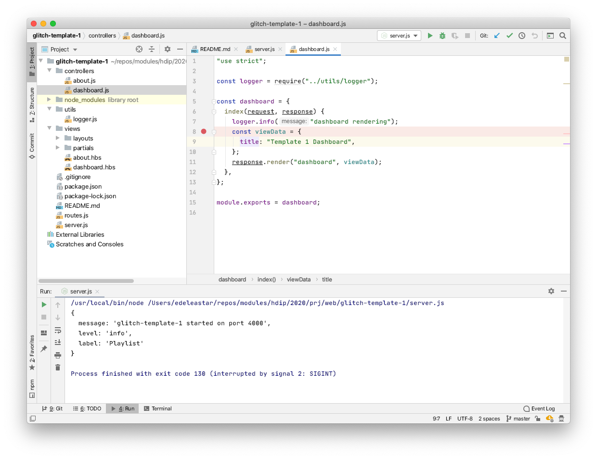
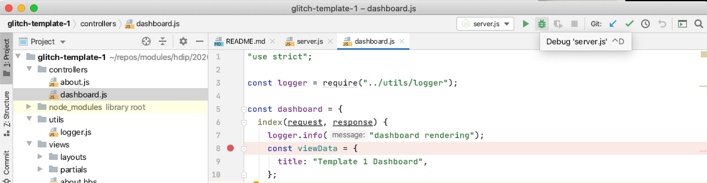
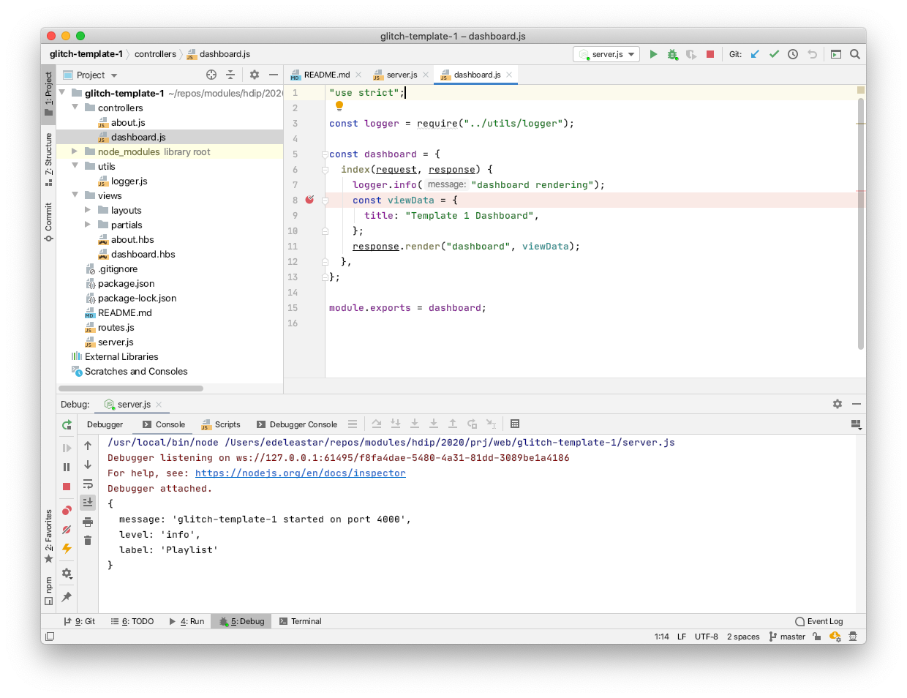
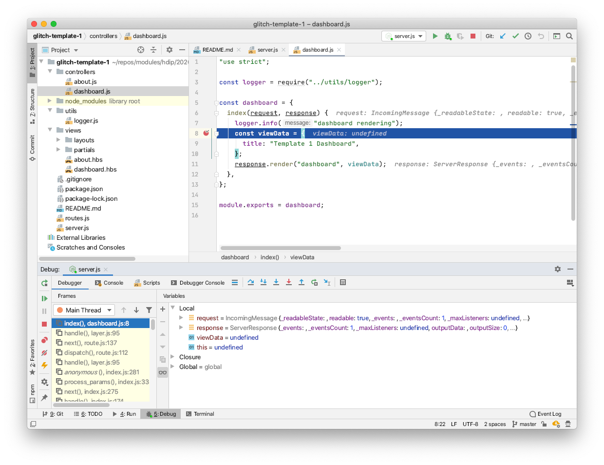
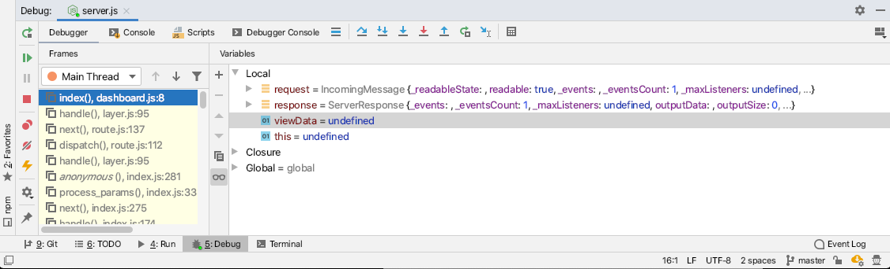

# Debug

One of the advantages of running the application in WebStorm is the availability of a local debugger facility. This will allow you to single step through the application, exploring the data structures at any give point in the execution.

To try out, first set a 'breakpoint' somewhere you wish to explore. This is done by clicking in the left margin of a line of interest, causing a red dot to appear:

Then, launch the application again, this time in `debug` mode be pressing the debug icon in the tool bar:

The IDE will be reconfigured into debug mode:

If you now open the application, and click on the `Dashboard` menu option, the breakpoint will be triggered and the application will stop on the breakpoint:

Inspect carefully the debug control panel along the bottom of the screen:

The buttons here will allow you to 'Step Over' and 'Step into' the code, executing each statement one at a time. 'Step Over' may be more the more common option.

Also notice that the variables are visible, and will change as you step through the code:

