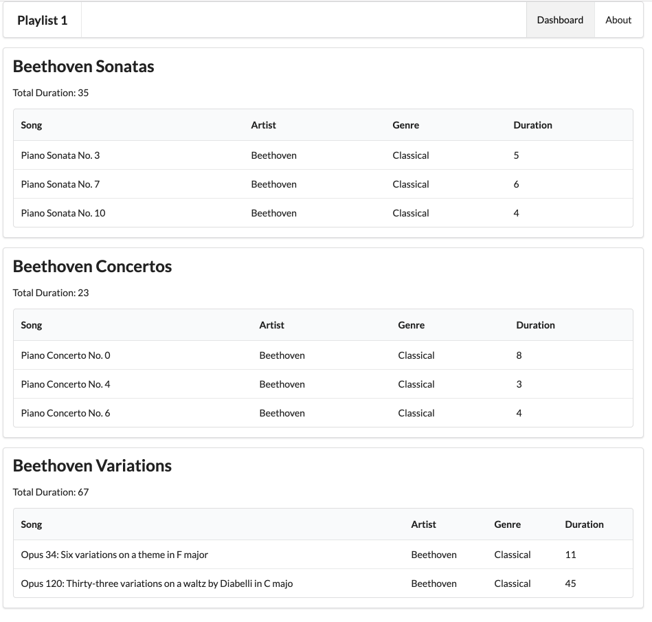

# Exercise Solutions

This lab requires that the `playlist-1` lab be completed. If you have lost your solution, create a new project in Glitch by cloning this repo:

- <https://github.com/wit-hdip-comp-sci-2021/playlist-1>

Instructions on how to do this are [here](https://tutors-svelte.netlify.app/#/lab/ict-skills-1-2021.netlify.app/topic-03-web-apps/unit-2/book-a-glitch-playlist-1/01). Remember to use the url above.

These are three exercises from the last lab:

## Exercise 2: Add a new playlist

Extend the JSON file to include an additional playlist - so that three playlists are displayed on the dashboard.

## Exercise 3: Introduce IDs

When manipulating data maintained in JSON, or other external format, each object will often require an ID in order to manipulate the information effectively. Introduce an ID for every playlist, and every song.

## Exercise 4: New Fields

Extend the playlist to have new entry called `duration`. Also, extend each song to also have a `duration` field + a `genre` field.

Modify the dashboard view to display these new fields.

## Solutions

These are solutions to all three exercises:

First the extended model:

## models/playlist-store.json

~~~js
{
  "playlistCollection": [
    {
      "id" : "01",
      "title": "Beethoven Sonatas",
      "duration": 35,
      "songs": [
        {
          "id" : "04",
          "title": "Piano Sonata No. 3",
          "artist": "Beethoven",
          "genre": "Classical",
          "duration": 5
        },
        {
          "id" : "05",
          "title": "Piano Sonata No. 7",
          "artist": "Beethoven",
          "genre": "Classical",
          "duration": 6
        },
        {
          "id" : "06",
          "title": "Piano Sonata No. 10",
          "artist": "Beethoven",
          "genre": "Classical",
          "duration": 4
        }
      ]
    },
    {
      "id" : "02",
      "title": "Beethoven Concertos",
      "duration": 23,
      "songs": [
        {
          "id" : "07",
          "title": "Piano Concerto No. 0",
          "artist": "Beethoven",
          "genre": "Classical",
          "duration": 8
        },
        {
          "id" : "08",
          "title": "Piano Concerto No. 4",
          "artist": "Beethoven",
          "genre": "Classical",
          "duration": 3
        },
        {
          "id" : "09",
          "title": "Piano Concerto No. 6",
          "artist": "Beethoven",
          "genre": "Classical",
          "duration": 4
        }
      ]
    },
    {
      "id" : "03",
      "title": "Beethoven Variations",
      "duration": 67,
      "songs": [
        {
          "id" : "10",
          "title": "Opus 34: Six variations on a theme in F major",
          "artist": "Beethoven",
          "genre": "Classical",
          "duration": 11
        },
        {
          "id" : "11",
          "title": "Opus 120: Thirty-three variations on a waltz by Diabelli in C majo",
          "artist": "Beethoven",
          "genre": "Classical",
          "duration": 45
        }
      ]
    }
  ]
}
~~~

Now we can revise the dashboard to show additional fields:

## views/dashboard.hbs

~~~html
{{> menu id="dashboard"}}

{{#each playlists}}
  <section class="ui segment">
    <h2 class="ui header">
      {{title}}
    </h2>
    
 Total Duration: {{duration}} 

    <table class="ui table">
      <thead>
        <tr>
          <th>Song</th>
          <th>Artist</th>
          <th>Genre</th>
          <th>Duration</th>
        </tr>
      </thead>
      <tbody>
        {{#each songs}}
          <tr>
            <td>
              {{title}}
            </td>
            <td>
              {{artist}}
            </td>
            <td>
              {{genre}}
            </td>
            <td>
              {{duration}}
            </td>
          </tr>
        {{/each}}
      </tbody>
    </table>
  </section>
{{/each}}
~~~

The dashboard should look like this now:

