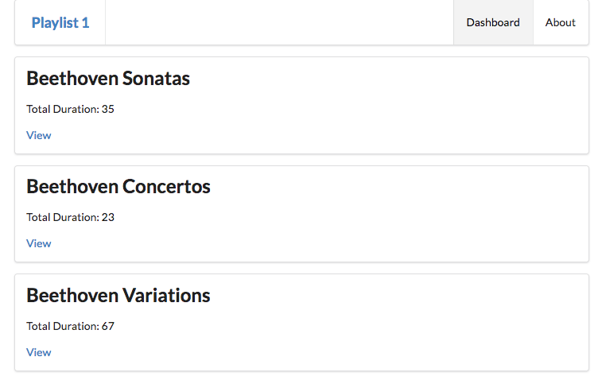
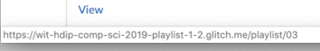

# Playlist Summaries

We would like to change the app to just display a list of playlists on the dashboard, not the complete contents of each playlist. Replace the current dashboard with the following:

## views/dashboard.hbs

~~~html
{{> menu id="dashboard"}}

{{#each playlists}}
  <section class="ui segment">
    <h2 class="ui header">
      {{title}}
    </h2>
    
 Total Duration: {{duration}} 

    <a href="#"> View </a>
  </section>
{{/each}}
~~~

This will render like this:

The `view` links are currently inert, but we would like them to cause a new view to be rendered, containing the playlist concerned.

As each playlist now has an ID, this can make this convenient to implement. Here is a new version of the `view` link:

~~~html
    <a href="/playlist/{{id}}"> View </a>
~~~

With this change in place, try hovering over each view link (without pressing it). In Chrome, keep an eye on the stats bar which should show a the link including the id:

Hover over each link and note how the ID changes. Clicking on any link causes the following error:

~~~
Cannot GET /playlist/02
~~~

We need a new controller to display a new view containing the playlist details. We will do this in the next step.
