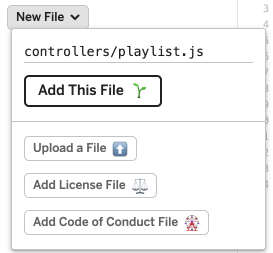
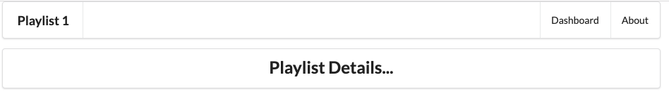

# Controller/View/Route

Bringing in a new controller usually requires three things:

- a controller
- a view
- a route

Here is is the new controller:

## controllers/playlist.js

~~~js
'use strict';

const logger = require('../utils/logger');
const playlistCollection = require('../models/playlist-store.js');

const playlist = {
  index(request, response) {
    const viewData = {
      title: 'Playlist',
    };
    response.render('playlist', viewData);
  },
};

module.exports = playlist;
~~~

Create this in glitch by pressing the `New File` button:

Make sure to enter the folder + file name as shown above.

This new controller will render a view called `playlist`. Create this view in glitch now:

## views/playlist.hbs

~~~html
{{> menu}}

<section class="ui center aligned middle aligned segment">
  <h2 class="ui header">
    Playlist Details...
  </h2>
</section>
~~~

Finally, the route. This will require the controller to be imported at the top of the module:

## routes.js

~~~js
...
const playlist = require('./controllers/playlist.js');
...
~~~

... and then we can add the new route:

~~~js
router.get('/playlist/:id', playlist.index);
~~~

Notice that the route includes this segment: `/:id`. This means it matches any route that includes an extra wildcard segment at the end.

Implement all of the above now and verify that the view is rendered as expected. 

It does not display the playlist yet - just a placeholder for the moment:

