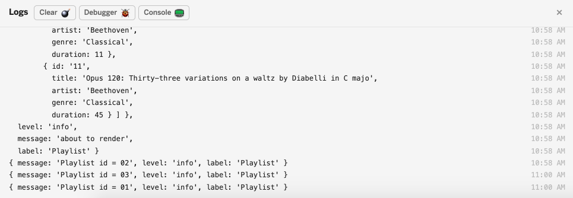
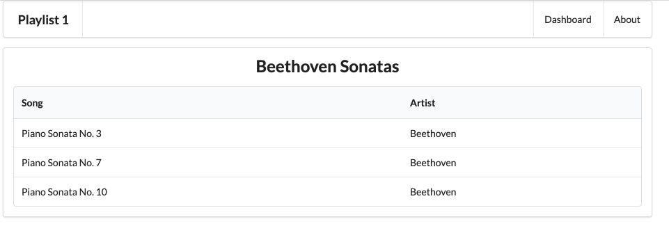

# Playlists

In order to display the correct playlist, we need to extract the id from the url. Modify the playlist controller index method as follows:

~~~js
  index(request, response) {
    const playlistId = request.params.id;
    logger.info('Playlist id = ' + playlistId);
    const viewData = {
      title: 'Playlist',
    };
    response.render('playlist', viewData);
  },
~~~

(be careful - it is just the index method we are replacing - not the entire module)

We are extracting and logging the id here:

~~~
    const playlistId = request.params.id;
    logger.info('Playlist id = ' + playlistId);
~~~

Run the app and select each of the playlist links in turn. The logs will display each of the Ids as you do this:

We need to find a way of locating the playlist with the id, and then pass this specific playlist to the view to be rendered. This requires a rethink of the model, in particular the `playlist-store.js` module.

This currently looks like this:

## models/playlist-sto
~~~
"use strict";

const playlistCollection = require("./playlist-store.json").playlistCollection;

module.exports = playlistCollection;
~~~

All it is doing is locating the playListCollection array in the playlist-store.json file and exporting it to whomsoever requires it.

Here is a new version of this module:

## models/playlist-store.js

~~~js
'use strict';

const playlistStore = {

  playlistCollection: require('./playlist-store.json').playlistCollection,

  getAllPlaylists() {
    return this.playlistCollection;
  },

  getPlaylist(id) {
    let foundPlaylist = null;
    for (let playlist of this.playlistCollection) {
      if (id == playlist.id) {
        foundPlaylist = playlist;
      }
    }

    return foundPlaylist;
  },
};

module.exports = playlistStore;
~~~

In this version, we have an object `playlsitStore` one attribute:

- `playListCollection`: this is the array of playlists loaded from the json file.

and two functions:

- `getAllPlaylists()` : return all playlists
- `getlPlaylist(id)`: locate and return a specific playlist.

The Dashboard controller will have to be refactored to use this object:

## controllers/dashboard.js

~~~js
"use strict";

const logger = require("../utils/logger");
const playlistStore = require('../models/playlist-store');

const dashboard = {
  index(request, response) {
    logger.info('dashboard rendering');
    const viewData = {
      title: 'Playlist Dashboard',
      playlists: playlistStore.getAllPlaylists(),
    };
    logger.info('about to render', playlistStore.getAllPlaylists());
    response.render('dashboard', viewData);
  },
};

module.exports = dashboard;
~~~

In the above we are importing the playListStore object. Then, when we are creating the viewData object, we are calling `playlistStore.getAllPlaylists()`. This will place all playlists into the viewData object.

Finally, the playlists controller + view can be implemented:

## controllers/playlist.js

~~~js
'use strict';

const logger = require('../utils/logger');
const playlistStore = require('../models/playlist-store');

const playlist = {
  index(request, response) {
    const playlistId = request.params.id;
    logger.debug('Playlist id = ', playlistId);
    const viewData = {
      title: 'Playlist',
      playlist: playlistStore.getPlaylist(playlistId),
    };
    response.render('playlist', viewData);
  },
};

module.exports = playlist;
~~~

Notice the way in which we are creating the viewData object this time:

~~~
    const viewData = {
      title: 'Playlist',
      playlist: playlistStore.getPlaylist(playlistId),
    };
~~~

We are getting as specific playlist - with the id playlistId - and placing it in the viewData object.

Now we can now rework playlist.hbs to display the playlist title + trigger listsongs.hbs:

## views/playlist.hbs

~~~html
{{> menu}}

<section class="ui center aligned middle aligned segment">
  <h2 class="ui header">
    {{playlist.title}}
  </h2>
  {{> listsongs}}
</section>
~~~

Listsongs will pick up the playlist and display each song (look at the listsongs.hbs again)

The app should now run as expected, with playlist summaries on the dashboard, and a view link rendering the playlists details:

