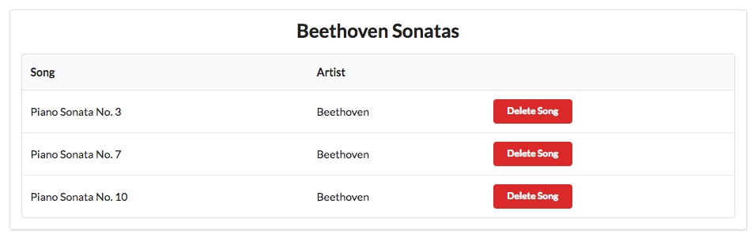

# Deleting Songs : Part 1

Having a playlist app, without the ability to create/delete songs or playlists is clearly very limited. We have, essentially, an app that allows us to `Read` our models, but not `Create`, `Update` or `Delete` elements of the model.

We can start with providing a facility to delete songs from individual playlists. At the end of this step our view will look like this:

Pressing the delete button should remove the corresponding song.

Any new button/link/action on our page requires:

- an element in a view
- a route matching the view element
- a matching controller function

.. and it may also involve some interaction with the model.

# View

The new button must appear in each song row:

## views/partials/listsongs.hbs

~~~html
    ...
        <td>
          <a href="/playlist/{{../playlist.id}}/deletesong/{{id}}" class="ui tiny red button">Delete Song</a>
        </td>
    ...
~~~

# Route

A new route - containing both the playlist and song id - and linking to a new function in the playlist controller:

## routes.js

~~~js
router.get('/playlist/:id/deletesong/:songid', playlist.deleteSong);
~~~

# Controller

This is a new method to handle this route in the playlist controller:

## controllers/playlist.js

~~~js
  deleteSong(request, response) {
    const playlistId = request.params.id;
    const songId = request.params.songid;
    logger.debug(`Deleting Song ${songId} from Playlist ${playlistId}`);
    playlistStore.removeSong(playlistId, songId);
    response.redirect('/playlist/' + playlistId);
  },
~~~

# Model

The model now needs a new method to delete a song, given the id of the playlist and the song:

## models/playlist-store.js

~~~js
  removeSong(id, songId) {
    const playlist = this.getPlaylist(id);

    // TODO : remove the song with id songId from the playlist
  },
~~~

Try all of this now - and verify that the logs shows the attempt to delete the song when the button is pressed.

We havent actually deleted the song - we will leave that to the next step.

