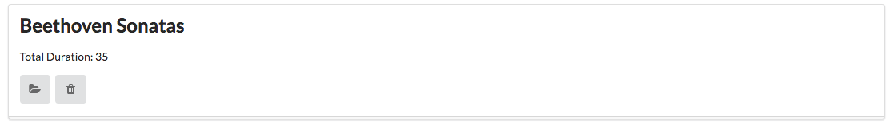

# Exercises

If you want to download a complete version of the app as it should be at the end of this lab, then create a new Glitch project, and clone this repo:

- <https://github.com/wit-hdip-comp-sci-2021/playlist-2>

## Exercise 1: UX Enhancements

Introduce a 'Delete Playlist' button for each playlist, represented by a `trash` icon. E.g:

In addition, the `view` link is replace by a `folder open` icon.

Bind the `delete playlist` button to a new function to be implemented in the Dashboard controller, which should log the id of the playlist to be deleted.

## Exercise 2: Delete Playlist Functionality

Make the button actually delete the denoted playlist.

HINT: This is a new function in the `playlist-store` module to delete a playlist, given an ID:

~~~js
removePlaylist(id) {
  _.remove(this.playlistCollection, { id: id });
},
~~~

Try to implement the rest of the feature, using the song delete feature as a guide.

## Exercise 3: Run Locally

Download the app and run it on your own workstation. To do this, download the zip of the project and run `npm install` in the folder. Then open in WebStorm. Instructions, with screen shots as in [Lab-03b](https://tutors-svelte.netlify.app/#/lab/ict-skills-1-2021.netlify.app/topic-03-web-apps/unit-2/book-b-web-storm/03)

