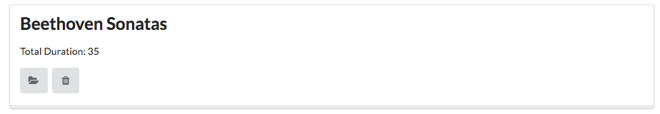
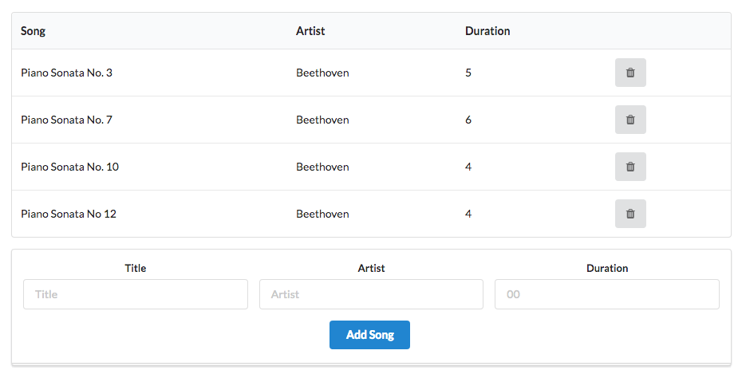

# Exercises

If you want to download a complete version of the app as it should be at the end of this lab, then create a new Glitch project, and clone this repo:

- <https://github.com/wit-hdip-comp-sci-2021/playlist-3>

You can also clone this repo directly, run 'npm install' from inside the folder and then run from within Webstorm.

## Exercise 1: Display Durations

Make sure the duration of each song and playlist is visible on the UX

## Exercise 2: Add Song Duration

Modify the add song form to accept a song duration as well as title and artist:

Make sure the duration is stored in the data store, and is displayed on the playlist view.

HINT: When reading a parameter from a form representing a number, you will need to convert it from string. The `Number` function is one simple way of doing this:

~~~
    const newSong = {
      id: uuid(),
      title: request.body.title,
      artist: request.body.artist,
      duration: Number(request.body.duration),
    };
~~~

## Exercise 3: Active Duration

The durations in each playlist are just constants stored in the database. Currently, if you add a new playlist + songs, then the duration in the playlist will be undefined.

Change this now, such that when you add a song to a playlist the duration displayed on the dashboard for each playlist will be the actual sum of the donations for all songs in the playlist.

HINT: One way of dong this is to update the `addSong()` method in the `playlist-store` object:

~~~
  addSong(id, song) {
    const playlist = this.getPlaylist(id);
    playlist.songs.push(song);

    let duration = 0;
    // Iterate over the playlist.songs array, and accumulate the duration of each
    // song into the duration local variable.
    // ...
    // ...

    // Now store the duration in playlist.store
    // ...
    
    this.store.save();
  },
~~~