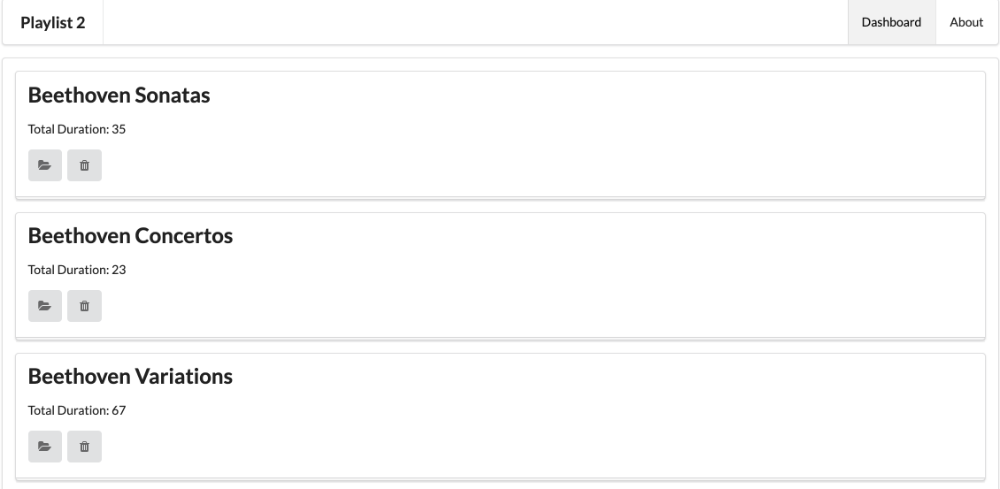

# Exercise Solutions

This lab requires that the `playlist-2` lab be completed. If you have lost your solution, create a new project in Glitch by cloning this repo:

- <https://github.com/wit-hdip-comp-sci-2021/playlist-2>

Instructions on how to do this are [here](https://tutors-svelte.netlify.app/#/lab/ict-skills-1-2021.netlify.app/topic-03-web-apps/unit-2/book-a-glitch-playlist-1/01). Remember to use the url above.

These are the exercises from the last lab:

## Exercise 1: UX Enhancements & Exercise 3: listplaylists partial

Introduce a 'Delete Playlist' button for each playlist, represented by a `trash` icon.

First, create a new partial:

## views/partials/listplaylists.hbs

~~~html
{{#each playlists}}
  <section class="ui stacked segment">
    <h2 class="ui header">
      {{title}}
    </h2>
    
 Total Duration: {{duration}} 

    <a href="/playlist/{{id}}" class="ui icon button">
      <i class="icon folder open"></i>
    </a>
    <a href="/dashboard/deleteplaylist/{{id}}" class="ui icon button">
      <i class="icon trash"></i>
    </a>
  </section>
{{/each}}
~~~

Now we can refactor the dashboard partial to use this:

## views/dashboard.hbs

~~~html
{{> menu id="dashboard"}}

<section class="ui segment">
  {{> listplaylists}}
</section>
~~~

The UI should look like this:

However, the delete (trash) button doesn't work yet (try it).

## Exercise 2: Delete Playlist Functionality

Make the button actually delete the denoted playlist.

First, a route to delete the playlist:

## routes.js

~~~js
...
router.get('/dashboard/deleteplaylist/:id', dashboard.deletePlaylist);
...
~~~

Then the method to implement this route:

## controllers/dashboard.js

~~~js
...
  deletePlaylist(request, response) {
    const playlistId = request.params.id;
    logger.debug(`Deleting Playlist ${playlistId}`);
    playlistStore.removePlaylist(playlistId);
    response.redirect('/dashboard');
  },
...
~~~

When introducing the new method above, you will need to separate the method from the existing index method with a comma - an syntax error will appear of you forget this. Here is the complete dashboard.js for reference:

~~~
"use strict";

const logger = require("../utils/logger");
const playlistStore = require("../models/playlist-store");

const playlist = {
  index(request, response) {
    const playlistId = request.params.id;
    logger.debug("Playlist id = ", playlistId);
    const viewData = {
      title: "Playlist",
      playlist: playlistStore.getPlaylist(playlistId)
    };
    response.render("playlist", viewData);
  },

  deleteSong(request, response) {
    const playlistId = request.params.id;
    const songId = request.params.songid;
    logger.debug(`Deleting Song ${songId} from Playlist ${playlistId}`);
    playlistStore.removeSong(playlistId, songId);
    response.redirect("/playlist/" + playlistId);
  }
};

module.exports = playlist;
~~~

Finally, we need a new method on playlist-store to delete the playlist form the model:

## models/playlist-store.js

~~~js
  removePlaylist(id) {
    _.remove(this.playlistCollection, { id: id });
  },
~~~

Again, a comma may be needed. This is the complete playlist-store at this stage:

~~~
"use strict";

const _ = require("lodash");

const playlistStore = {
  playlistCollection: require("./playlist-store.json").playlistCollection,

  getAllPlaylists() {
    return this.playlistCollection;
  },

  getPlaylist(id) {
    return _.find(this.playlistCollection, { id: id });
  },

  removeSong(id, songId) {
    const playlist = this.getPlaylist(id);
    _.remove(playlist.songs, { id: songId });
  },
  
  removePlaylist(id) {
    _.remove(this.playlistCollection, { id: id });
  },
};

module.exports = playlistStore;
~~~

Verify now that you can delete playlists.

