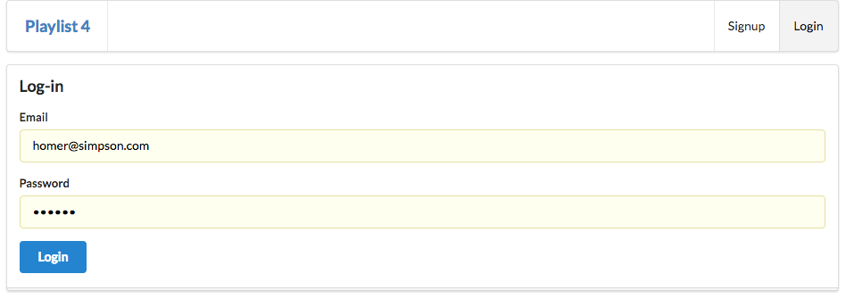

# Routes

To support the users, we need a new set of routes:

## routes.js

First, import the accounts module towards the top if the routes file:

~~~
...
const accounts = require('./controllers/accounts.js');
...
~~~

Then we can append these new routes:
~~~
...
router.get('/', accounts.index);
router.get('/login', accounts.login);
router.get('/signup', accounts.signup);
router.get('/logout', accounts.logout);
router.post('/register', accounts.register);
router.post('/authenticate', accounts.authenticate);
...
~~~

We also need to remove this existing route, as we are replacing it:

~~~
router.get("/", dashboard.index);
~~~

This is the complete revised routes.js

~~~
'use strict';

const express = require('express');
const router = express.Router();

const dashboard = require('./controllers/dashboard.js');
const about = require('./controllers/about.js');
const playlist = require('./controllers/playlist.js');
const accounts = require('./controllers/accounts.js');

router.get('/', accounts.index);
router.get('/login', accounts.login);
router.get('/signup', accounts.signup);
router.get('/logout', accounts.logout);
router.post('/register', accounts.register);
router.post('/authenticate', accounts.authenticate);

router.get('/dashboard', dashboard.index);
router.get('/dashboard/deleteplaylist/:id', dashboard.deletePlaylist);
router.post('/dashboard/addplaylist', dashboard.addPlaylist);

router.get('/about', about.index);
router.get('/playlist/:id', playlist.index);
router.get('/playlist/:id/deletesong/:songid', playlist.deleteSong);
router.post('/playlist/:id/addsong', playlist.addSong);

module.exports = router;
~~~

Finally, in order to support the logout feature, we need to add a new option to the main menu:

## views/partials/menu.hbs

~~~
<nav class="ui menu">
  <header class="ui header item"> <a href="/"> Playlist 4 </a></header>
  

    <a id="dashboard" class="item" href="/dashboard"> Dashboard  </a>
    <a id="about" class="item" href="/about"> About </a>
    <a id="logout" class="item" href="/logout"> Logout </a>
  

</nav>

~~~

The application should be running now. You should see these new views:

### A new landing page

### Signup

### login

