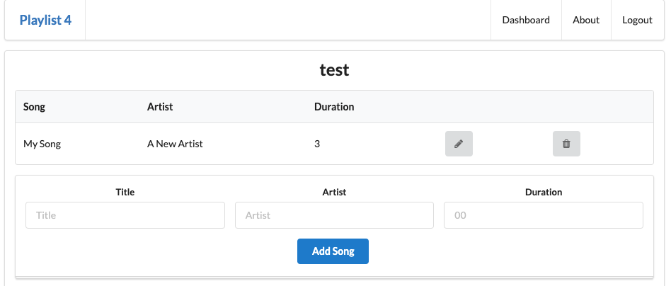
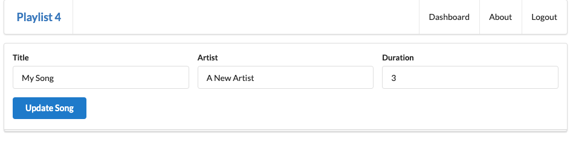
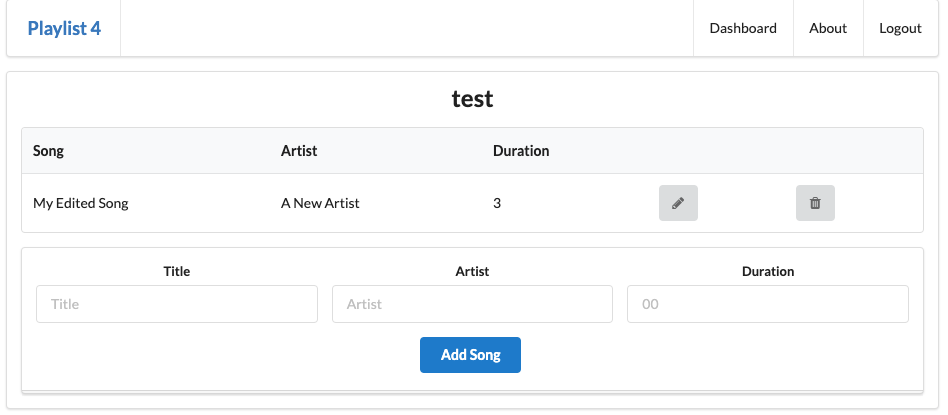

# Setup

This lab requires that the `playlist-4` lab be completed. If you have lost your solution, create a new project in Glitch by cloning this repo:

- <https://github.com/wit-hdip-comp-sci-2021/playlist-4>

Instructions on how to do this are [here](https://tutors-svelte.netlify.app/#/lab/ict-skills-1-2021.netlify.app/topic-03-web-apps/unit-2/book-a-glitch-playlist-1/01). Remember to use the url above.

## Feature outline

We would like introduce a way to allow an existing song to be edited. This will be via a new button listed with each song:

When this button is pressed, then we can modify the songs fields in a new view:

When update is pressed, we should see the updated song:

