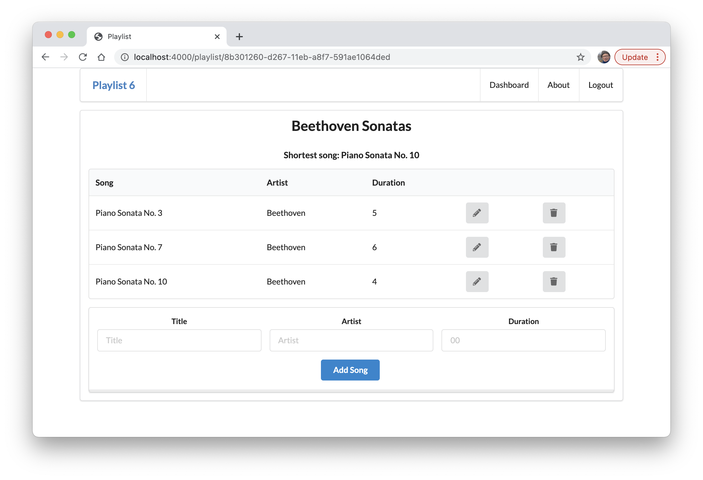

# Update the View

To display the shortest song, we need to pass the data to the view. Change the method as follows:

~~~javascript
    const viewData = {
      title: "Playlist",
      playlist: playlistStore.getPlaylist(playlistId),
      shortestSong: shortestSong
    };
    response.render("playlist", viewData);
~~~

We can then change playlist.html to display this new information:

### playlist.hbs

~~~html
{{> menu}}

<section class="ui center aligned middle aligned segment">
  <h2 class="ui header">
    {{theList.title}}
  </h2>
  <h4> Shortest song: {{shortestSong.title}}</h4>
  {{> listsongs}}
  {{> addsong}}
</section>
~~~

We have just added this line:

~~~html
  <h4> Shortest song: {{shortestSong.title}}</h4>
~~~

This should render like this:

