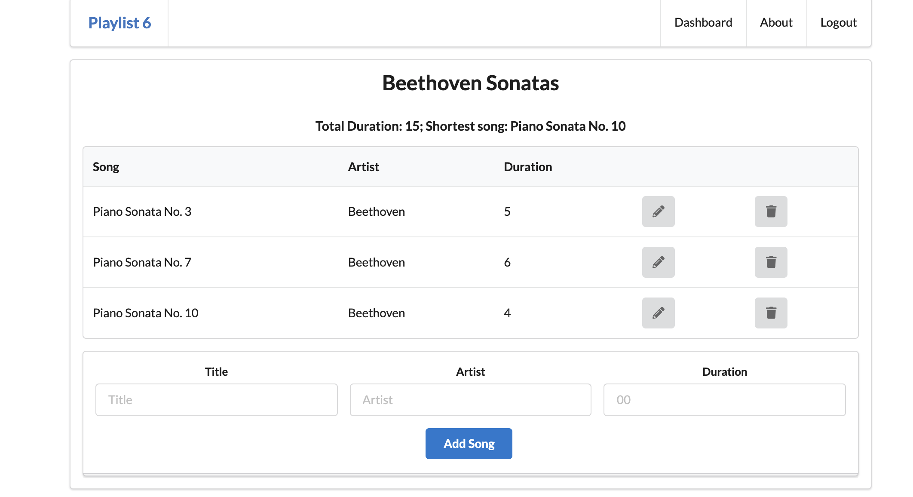

# Exercise 1

Complete version so far:

- <https://github.com/wit-hdip-comp-sci-2021/playlist-6/releases/tag/02>

  

## Exercise 1

Extend the application such that the total duration of each playlist is displayed like this:

### Solution

Include an additional method `getPlaylistDuration()` in the playlist-analytics module:

#### utils/playlist-analytics.js

~~~javascript
"use strict";

const playlistAnalytics = {
  getShortestSong(playlist) {
    let shortestSong = null;
    if (playlist.songs.length > 0) {
      shortestSong = playlist.songs[0];
      for (let i = 1; i < playlist.songs.length; i++) {
        if (playlist.songs[i].duration < shortestSong.duration) {
          shortestSong = playlist.songs[i];
        }
      }
    }
    return shortestSong;
  },
  
  getPlaylistDuration(playlist) {
    let playlistDuration = 0;
    for (let i = 0; i < playlist.songs.length; i++) {
      let song = playlist.songs[i];
      playlistDuration = playlistDuration + song.duration;
    }
    return playlistDuration;
  }
};

module.exports = playlistAnalytics;
~~~

Then rework the controller to call this method:

#### controllers/playlist.js

~~~javascript
//...
const playlist = {
  index(request, response) {
    const playlistId = request.params.id;
    logger.debug("Playlist id = ", playlistId);

    const playlist = playlistStore.getPlaylist(playlistId);
    const shortestSong = playlistAnalytics.getShortestSong(playlist);
    console.log(shortestSong);
    const duration = playlistAnalytics.getPlaylistDuration(playlist);
    console.log(duration);
    const viewData = {
      title: "Playlist",
      playlist: playlistStore.getPlaylist(playlistId),
      shortestSong: shortestSong,
      duration: duration
    };
    response.render("playlist", viewData);
  },
  //...
~~~

Finally, display the duration:

#### views/playlist.hbs

~~~handlebars
{{> menu}}

<section class="ui center aligned middle aligned segment">
  <h2 class="ui header">
    {{playlist.title}}
  </h2>
  <h4> Total Duration: {{duration}}; Shortest song: {{shortestSong.title}}</h4>
  {{> listsongs}}
  {{> addsong}}
</section>
~~~

Complete version so far:

- <https://github.com/wit-hdip-comp-sci-2021/playlist-6/releases/tag/03>

  
