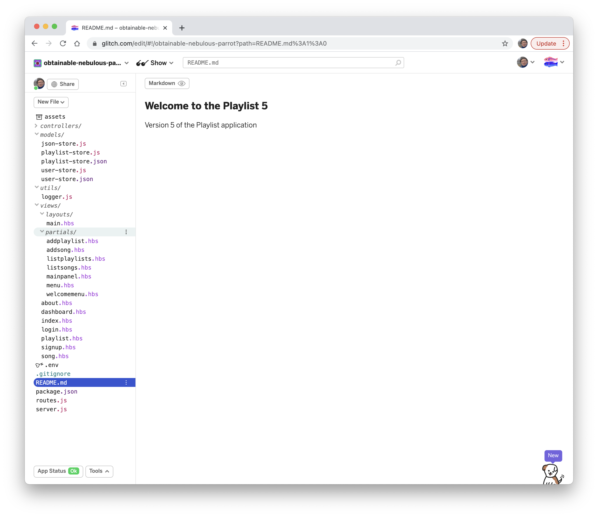
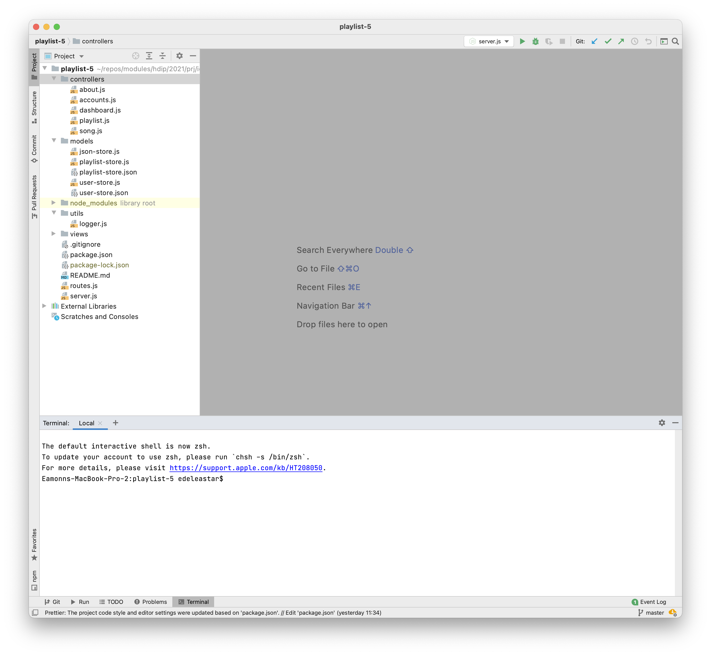
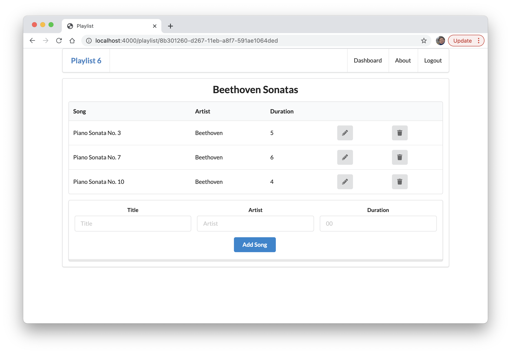
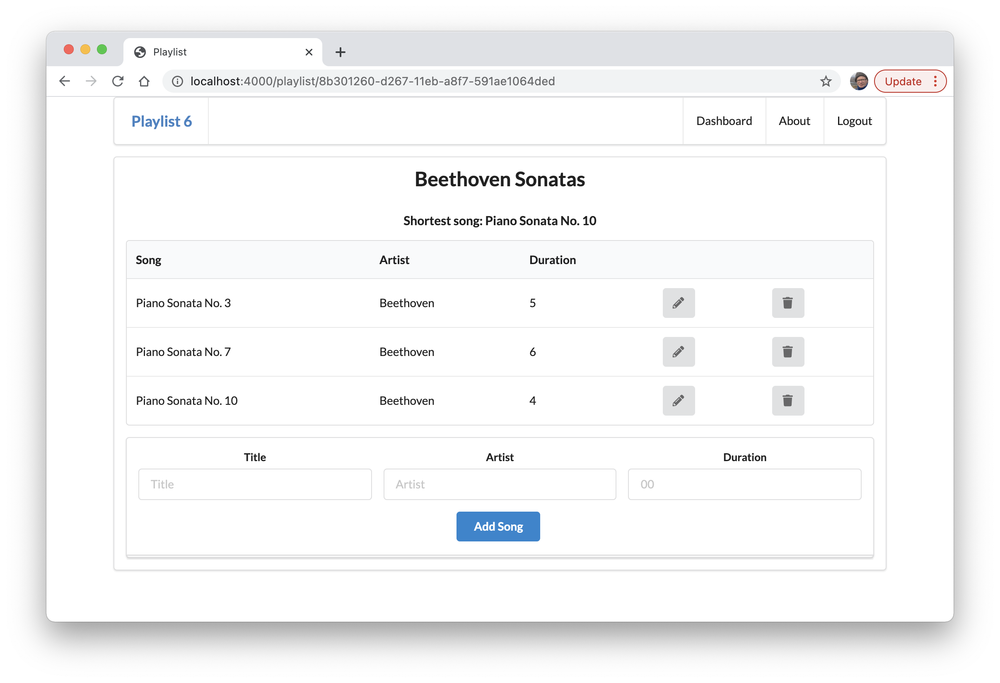

# Feature

On glitch, your project shoud look like this:

If you use WebStorm - then the project will look like this:

If we run the application, and open the first playlist we will see something like this:

We would like to develop a feature to display the shortest song along the top like this:

