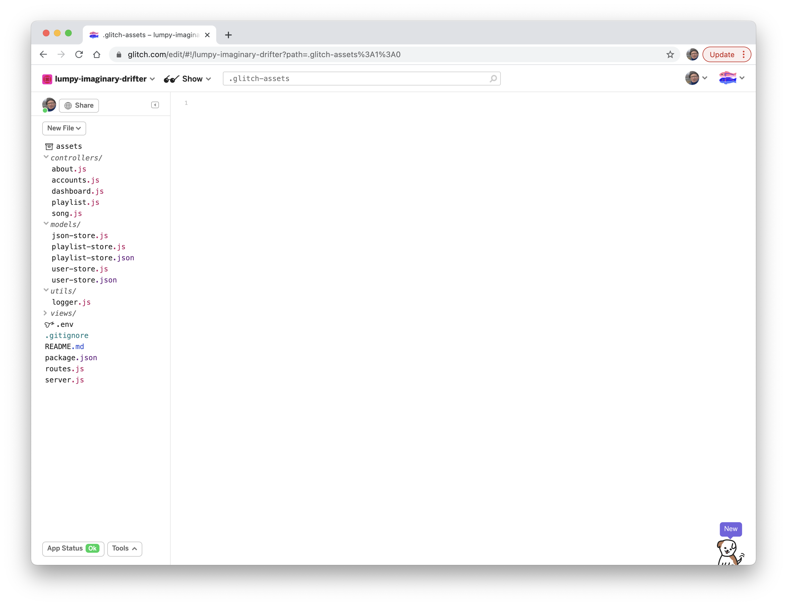
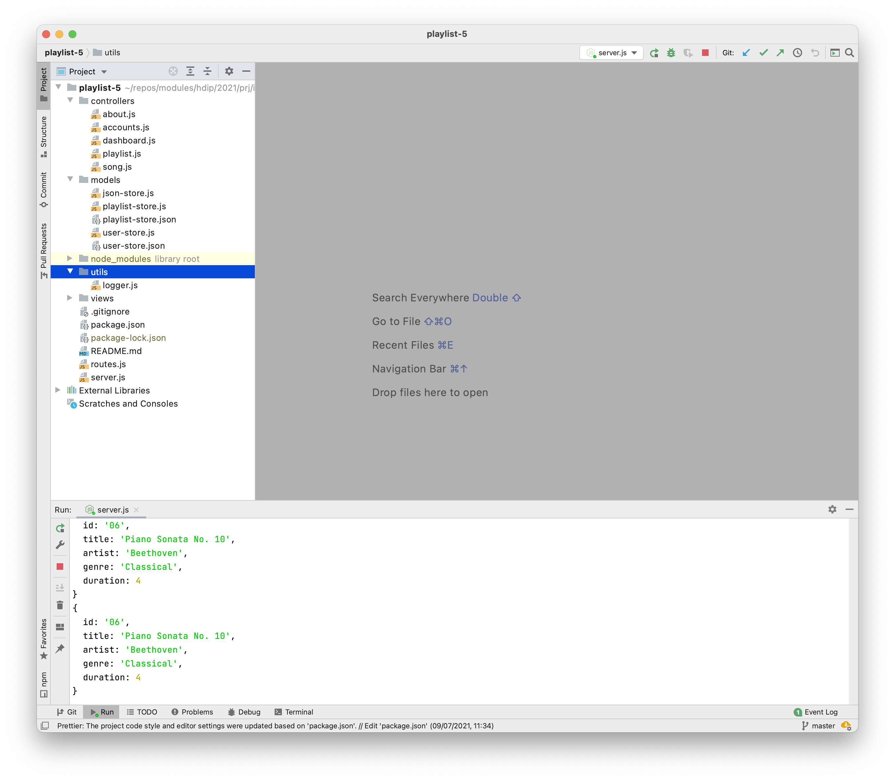

# Utils Pattern

This is our current index method in the playlist controller:

~~~javascript
  index(request, response) {
    const playlistId = request.params.id;
    logger.debug("Playlist id = ", playlistId);

    let shortestSong = null;
    const playlist = playlistStore.getPlaylist(playlistId)
    if (playlist.songs.length > 0) {
      shortestSong = playlist.songs[0];
      for (let i = 1; i < playlist.songs.length; i++) {
        if (playlist.songs[i].duration < shortestSong.duration) {
          shortestSong = playlist.songs[i];
        }
      }
    }
    console.log(shortestSong);
    const viewData = {
      title: "Playlist",
      playlist: playlistStore.getPlaylist(playlistId),
      shortestSong: shortestSong
    };
    response.render("playlist", viewData);
  },
~~~

This works fine - but imagine if we had also a need for some other information:

- Total duration
- Longest Song
- Average Duration
- etc...

We could envisage solving each of this problems with a new algorithm - and incorporating the algorithm into the method above. However, this would yield a very long method! Before tacking any of the above, we might decide to move the algorithm out int a utility class:

We already have a utils folder in our project:

Create a new javascript module in here:

### playlist-analytics.js

~~~javascript
"use strict";

const playlistAnalytics = {
  
  getShortestSong(playlist) {
    let shortestSong = null;
    if (playlist.songs.length > 0) {
      shortestSong = playlist.songs[0];
      for (let i = 1; i < playlist.songs.length; i++) {
        if (playlist.songs[i].duration < shortestSong.duration) {
          shortestSong = playlist.songs[i];
        }
      }
    }
    return shortestSong;
  }
};

module.exports = playlistAnalytics;
~~~

Note that we pass the playlist as a parameter - and return the shortest song.

We can now simplify the Playlist Controller index method:

~~~javascript
  index(request, response) {
    const playlistId = request.params.id;
    logger.debug("Playlist id = ", playlistId);

    const playlist = playlistStore.getPlaylist(playlistId);
    const shortestSong = playlistAnalytics.getShortestSong(playlist);
    console.log(shortestSong);
    const viewData = {
      title: "Playlist",
      playlist: playlistStore.getPlaylist(playlistId),
      shortestSong: shortestSong
    };
    response.render("playlist", viewData);
  },
~~~

In the above, we are just calling the method instead of implementing the algorithm inline. There is no change in the view. Specifically, we first get the playlist object from the store:

~~~javascript
   const playlist = playlistStore.getPlaylist(playlistId);
~~~

Then we call the analytics method to find the shortest song:

~~~javascript
    const shortestSong = playlistAnalytics.getShortestSong(playlist);
~~~

Finally, we make sure to pass shortestSong object to the view:

~~~javascript
    const viewData = {
      title: "Playlist",
      playlist: playlistStore.getPlaylist(playlistId),
      shortestSong: shortestSong
    };
    response.render("playlist", viewData);
~~~

... where it can be rendered on the page:

~~~html
  <h4> Shortest song: {{shortestSong.title}}</h4>
~~~

